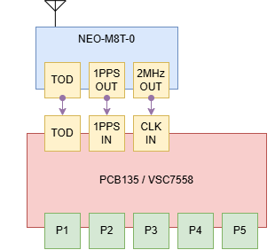
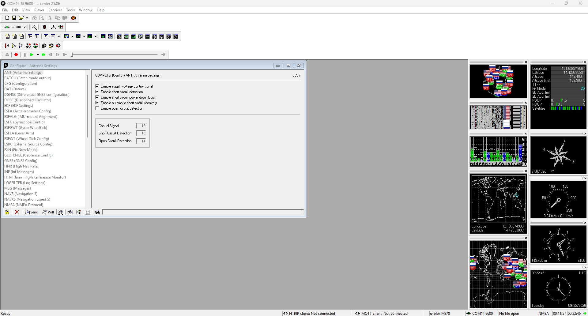
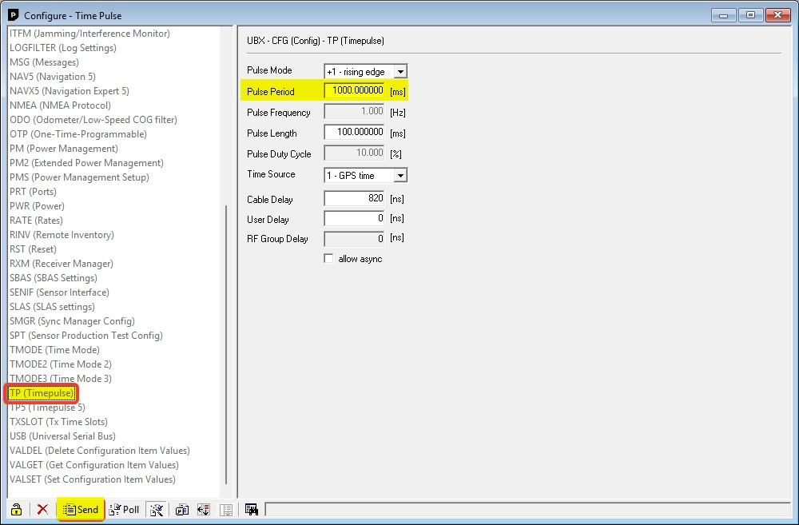
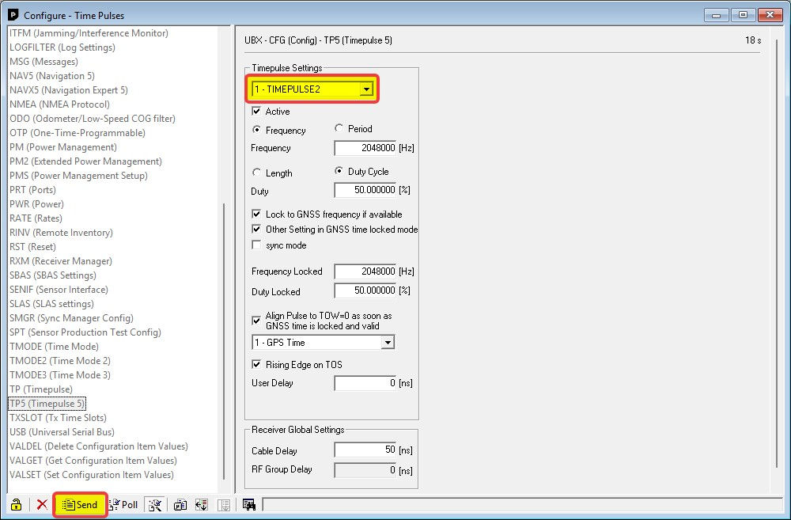
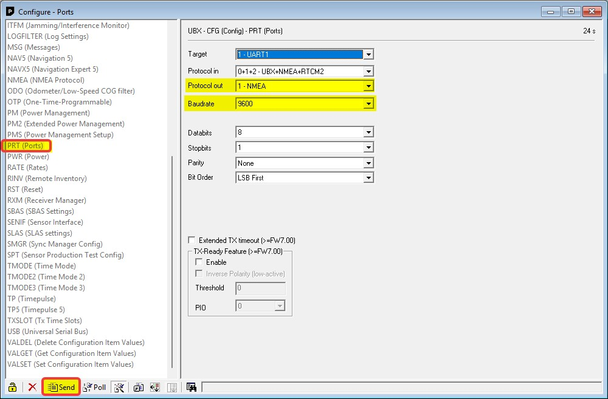
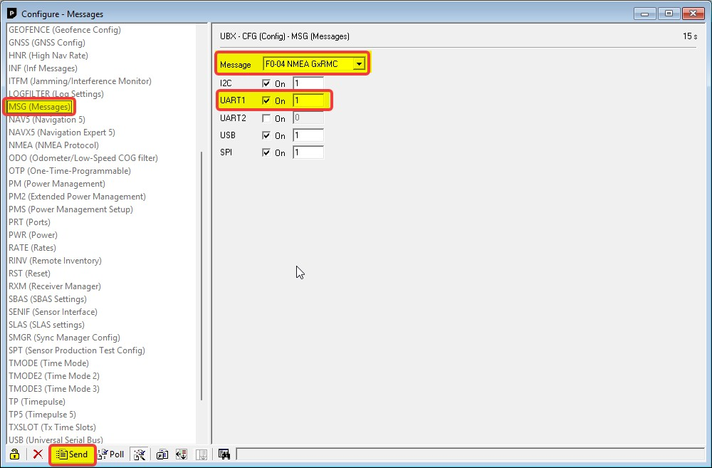
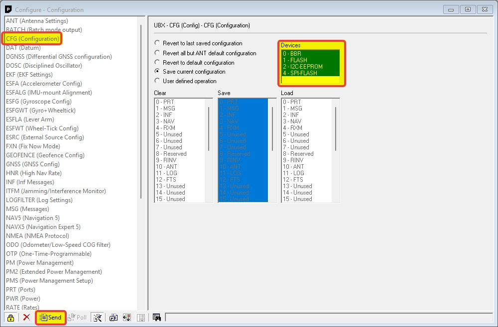

# GNSS Timing Integration
## 1 Objective

Deliver 1PPS and NMEA Time-of-Day (ToD) from the NEO-M8T GNSS Timing Module into the VSC5641EV so that the VSC7558 PTP engine and the on-board ZL30772 DPLL can lock to GNSS.

## 2 Test Topology



| Signal              | Path                                                                                                                                                                 |
| ------------------- | -------------------------------------------------------------------------------------------------------------------------------------------------------------------- |
| **1PPS**            | NEO-M8T TP1 → **VSC5641EV PPS IN / J13 (SMA)**                                                                                                                       |
| **Reference clock** | NEO-M8T TP2, configured for **2.048 MHz** because [10 MHz fails DPLL lock](#61-neo-m8t-10-mhz-fails-dpll-lock), expected behavior → **VSC5641EV 10M IN / J29 (SMA)** |
| **ToD (NMEA)**      | NEO-M8T TXD → MAX485 module → RS-422 connector (RJ-45)                                                                                                               |

---
## 3 GNSS Timing Module Configuration (NEO-M8T)

Configuration is done in **[u-center](https://www.u-blox.com/en/product/u-center)**.

### 3.1 View → Configuration View or Press:

++ctrl+f9++



### 3.2 **TP1 → 1PPS:** `UBX-CFG-TP5`, target = TIMEPULSE

- 1 Hz, ~100 ms pulse width, **duty cycle 10%**, rising edge = on-time edge



### 3.3 **TP2 → reference clock:** `UBX-CFG-TP5`, target = TIMEPULSE2

- Continuous frequency output, **duty cycle 50%**
- Desired frequency is **2.048 MHz** (10 MHz electrically works but is not usable for DPLL lock)
- `UBX-CFG-TP5` has separate **freq** (unlocked) and **freqLocked** (GNSS-locked) fields, set **both** to 2.048 MHz, otherwise the output frequency changes when the receiver transitions between fix states



### 3.4 **ToD (NMEA):** `UBX-CFG-MSG`

- UART default: **9600 baud, 8N1**: must match the switch's `ptp rs422 baudrate 9600 parity none wordlength 8 stopbits 1 flowctrl none`
- Disable every NMEA sentence except **RMC** (the module sends `$GNZDA` by default, which the switch app doesn't parse and logs as a benign but noisy error)






### 3.5 **Save the configuration:** `UBX-CFG-CFG`

- All of the above (TP5 settings, CFG-MSG sentence selection) live in RAM until saved. Use `UBX-CFG-CFG` to commit the current configuration to BBR/Flash so it survives a power cycle, otherwise every setting reverts to default on reboot.




---

## 4 TSN Switch Configuration (VSC5641EV)

Log-in as Admin to PCB135 using **`ICLI`**, then configure the following:

```console
# configure terminal
```

```console
(config)# ptp 0 mode boundary onestep ethernet twoway vid 1 0 profile g8275.1 mep 1
(config)# ptp 0 filter-type aci-basic-phase-low
(config)# ptp 0 source-time-inaccuracy 0
(config)# ptp 0 gm-time-inaccuracy 0
(config)# ptp 0 dist-time-inaccuracy 0
(config)# ptp 0 virtual-port mode pps-in 2 pps-delay 5
(config)# ptp 0 virtual-port tod ser proto rmc
(config)# ptp rs422 baudrate 9600 parity none wordlength 8 stopbits 1 flowctrl none
(config)# exit
```

- `virtual-port mode pps-in 2`: the virtual port takes 1PPS from io-pin 2, i.e. the SMA `PPS IN / J13` path.
- `virtual-port tod ser proto rmc`: ToD is parsed from NMEA **RMC** sentences only, over the RS-422 serial link.
- `ptp rs422 baudrate 9600 ... `: matches the NEO-M8T's NMEA UART defaults (9600 8N1). **The NEO-M8T's own configuration must match this** (baud rate and sentence type).

---
## 5 Results
### 5.1 1PPS confirmation

```console
# platform debug allow
# debug trace module level ptp 1_pps noise
```

```{ .text .no-copy }
D ptp/1_pps 18:48:06 103/io_pin_pps_in_slave_handler#11796: I/O pin event: source_id 11, instance_id 0
D ptp/1_pps 18:48:06 103/io_pin_pps_in_slave_handler#11797: I/O pin: 2, pin mode 0
I ptp/1_pps 18:48:06 103/io_pin_pps_in_slave_handler#11804: inst: 0, devicetype 1, protocol 0
D ptp/1_pps 18:48:06 103/io_pin_pps_in_slave_handler#11805: io_pin 2, time     0 s_msb 1785912286 s   602983689 ns 12800 ps
D ptp/1_pps 18:48:06 103/ptp_external_input_slave_function#1814: DUMP: enable_t1[1 ]new_t1 [0], new_t2[1]
D ptp/1_pps 18:48:06 103/ptp_external_input_slave_function#1830: t2     0 s_msb 1785912286 s   602983689 ns 12800 ps
D ptp/1_pps 18:48:06 103/ptp_external_input_slave_function#1842: set new_t1 to false
```

`io_pin_pps_in_slave_handler` is capturing real timestamps on io-pin 2 with no error, and `ptp_external_input_slave_function` is consuming them. **TP1 --> J13 wiring and switch-app config confirmed good, end-to-end.**

### 5.2 ToD (RMC) confirmation

```console
# debug trace module level ptp serial_1pps noise
```

```{ .text .no-copy }
N ptp/serial_1pps 18:50:50 82/ptp_1pps_serial_thread#316: Received: $GNRMC,064731.00,A,1425.22003,N,12102.34818,E,0.218,120.86,050826,,,A*7F
D ptp/serial_1pps 18:50:50 82/ptp_1pps_convert_message_2_time#168: rmc message utc offset 0
D ptp/serial_1pps 18:50:50 82/ptp_1pps_convert_message_2_time#214: Successfully parsed serial message $GNRMC,064731.00,A,1425.22003,N,12102.34818,E,0.218,120.86,050826,,,A*7F
I ptp/serial_1pps 18:50:50 82/ptp_1pps_serial_thread#324: time received     0 s_msb 1785912451 s           0 ns     0 ps
N ptp/serial_1pps 18:50:50 82/ptp_1pps_serial_thread#316: Received: $GNZDA,064731.00,05,08,2026,00,00*74
N ptp/serial_1pps 18:50:50 82/ptp_1pps_convert_message_2_time#170: Error encountered while parsing message from GPS. Was probably not an NMEA RMC message.
```

```console
# show ptp 0 local-clock
```

```{ .text .no-copy }
PTP Time (0)    : 2026-08-05T06:51:11+00:00 986,975,190
Clock Adjustment method: Synce DPLL

# show ptp 0 port-state
VirtualPort  Enabled  PTP-State  Io-pin
-----------  -------  ---------  ------
         58  TRUE     slve            2
```

`ptp_1pps_serial_thread`/`ptp_1pps_convert_message_2_time` successfully parse the NEO-M8T's `$GNRMC` sentences, `show ptp 0 local-clock` reports the correct current UTC, and virtual port 58's `PTP-State` is `slve`, **locked to the ToD 1PPS**. The `$GNZDA` line each cycle throws a parse error, expected since the switch app is configured for `proto rmc` only and doesn't try to parse ZDA; it's benign but noisy.

## 6 Notes:

### 6.1 NEO-M8T 10 MHz fails DPLL lock

With TP2 configured to output 10MHz clock and wired into `10M IN / J29`, the ZL30772 fails to lock:

```console
# platform debug allow
# debug zl3077x ref status 2
```
```{ .text .no-copy }
Ref REF1P(2)+REF0P(0): 10 MHz         [FAIL] -- Flags: LOS:0 SCM:1 CFM:1 GST:1 PFM:1 -- Priority: 0
Ref REF0P(0)         : 125 MHz        [FAIL] -- Flags: LOS:0 SCM:1 CFM:1 GST:1 PFM:1 -- Priority: 0
```
```console
# debug zl3077x dpll status 2
```
```{ .text .no-copy }
DPLL[2]
        lock                 :: 0x0
        holdover             :: 0x0
        pull_in_hit          :: 0x0
        psl_hit              :: 0x0
        status               :: 0x0
        ref_in               :: 0xa
```

`LOS:0` means the pin sees edges, the physical connection is good and something is toggling. But `SCM`/`CFM`/`GST`/`PFM` (Single-Cycle, Coarse-Frequency, Guard-Soft-Transient, Precise-Frequency monitors, the ZL30772's ~±10% frequency-qualification window around the expected 10 MHz) **all fail**, so the reference is disqualified before it can ever become a lock candidate. `dpll status 2` confirms this: `ref_in:0xa` is the "no reference selected" sentinel (valid refs are 0-9), and `lock`/`holdover` are both `0x0` DPLL2 (the SyncE/frequency DPLL) is sitting in free-run with nothing valid to lock to.
#### Root cause:

The 10 MHz timing output (TP2) from the NEO-M8T free-runs off the module's local oscillator, which isn't accurate enough to pass SCM/CFM/PFM. So the ZL30772 is correctly rejecting it.