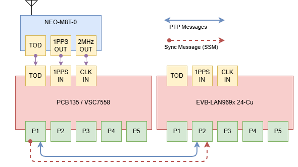

# G.8275.2 PTP Boundary Clock with SyncE Hybrid Mode


## 1 Objective

Demonstrate G.8275.2 telecom PTP with SyncE hybrid frequency and phase synchronization over an IPv4 unicast profile.

## 2 Test topology

The topology is GNSS to DUT1 (PCB135/VSC7558), then a SyncE and G.8275.2 PTP link to DUT3 (EVB-LAN969x 24-Cu).




The topology diagram is represented by the text topology below.

```text
GNSS (NEO-M8T)
  1PPS + NMEA (RS-422)
       │
       ▼
  DUT1, PCB135 / VSC7558
  192.168.137.158
  Role: Boundary Clock (GNSS-slaved)
  Gi 1/1 ─────────────────────────────── Gi 1/2
                                          DUT3, EVB-LAN969x 24-Cu
                                          192.168.137.96
                                          Role: Slave BC
```

- DUT1 slaved to GNSS via virtual port (1PPS + NMEA RMC), state **PHASE_LOCKED**
- DUT3 slaved to DUT1 via PTP packets + SyncE, state **FREQ_LOCKED → PHASE_LOCKED**

---

## 3 DUT1 configuration (PCB135 / VSC7558)

Log-in as Admin to PCB135 using **`ICLI`**, then configure the following:

!!! tip

	Clear all switch configuration back to default but keep the switch's IP address
	```console
	# reload defaults keep-ip force
	```

```console
# configure terminal
```

```console
(config)# ! PTP instance, G.8275.2 boundary clock
(config)# ptp 0 mode boundary onestep ip4unicast twoway vid 1 0 profile g8275.2 mep 1
(config)# ptp 0 filter-type aci-basic-phase

(config)# ! GNSS time-of-day input (serial RMC, 1PPS on io-pin 2)
(config)# ptp 0 virtual-port mode pps-in 2 pps-delay 5
(config)# ptp 0 virtual-port tod ser proto rmc

(config)# ! SyncE SSM on downstream ports
(config)# interface GigabitEthernet 1/1
(config-if)#  network-clock synchronization ssm
(config-if)# ptp 0
(config-if)# ptp 0 announce interval -3 timeout 3
(config-if)# ptp 0 sync-interval -4
(config-if)# ptp 0 delay-mechanism e2e
(config-if)# ptp 0 delay-req interval -4
(config-if)# exit
(config)# exit
```

Domain auto-selects **44** from the G.8275.2 profile, no manual domain config needed.

`preferred-adj` is not set, auto-select picks **common** for G.8275.2, which selects
`CLOCK_OPTION_SYNCE_DPLL`. This is the precondition for hybrid mode on any downstream
slave.

---

## 4 DUT3 configuration (EVB-LAN969x 24-Cu)

Log-in as Admin to EVB-LAN969x 24-Cu using **`ICLI`**, then configure the following:

!!! tip

	Clear all switch configuration back to default but keep the switch's IP address
	```console
	# reload defaults keep-ip force
	```

```console
# configure terminal
```

```console
(config)# ! PTP instance, G.8275.2 boundary clock (acts as slave toward DUT1)
(config)# ptp 0 mode boundary onestep ip4unicast twoway vid 1 0 profile g8275.2 mep 1
(config)# ptp 0 filter-type aci-basic-phase

(config)# ! Unicast master table, point to DUT1's management IP
(config)# ptp 0 uni 0 duration 300 192.168.137.158

(config)# ! SyncE, nominate the upstream port as frequency reference
(config)# network-clock clk-source 1 nominate interface GigabitEthernet 1/2
(config)# network-clock clk-source 1 aneg-mode slave
(config)# network-clock clk-source 1 ssm-overwrite prc
(config)# network-clock selector manual clk-source 1

(config)# ! PTP on the upstream port
(config)# interface GigabitEthernet 1/2
(config-if)# network-clock synchronization ssm
(config-if)# ptp 0
(config-if)# ptp 0 announce interval -3 timeout 3
(config-if)# ptp 0 sync-interval -4
(config-if)# ptp 0 delay-mechanism e2e
(config-if)# ptp 0 delay-req interval -4
(config-if)# exit
(config)# exit
```

The `ptp 0 uni` entry is the only addition vs G.8275.1. It triggers unicast grant
negotiation (Signaling REQUEST → GRANT). `CommState` progresses `INIT → SYNC`
within ~20 s.

---

## 5 G.8275.2 vs G.8275.1

| | G.8275.1 | G.8275.2 |
|---|---|---|
| Transport | Ethernet multicast (Layer 2) | IPv4 unicast (UDP, Layer 3) |
| Domain | 24 | 44 |
| Topology requirement | Full on-path (every hop must be PTP-aware) | Partial on-path (PTP-unaware routers allowed) |
| Slave config extra | none | `ptp 0 uni 0 duration <s> <master-ip>` |
| Session setup | none (multicast, auto-discovers master) | Unicast negotiation via Signaling (INIT → SYNC, ~20 s) |
| Network scope | Same L2 domain / VLAN | Routable across IP subnets |
| Hybrid mode | Yes | Yes (same 3 conditions) |

**When to use G.8275.2**: master and slave are separated by an IP router, or the
network does not support Ethernet multicast end-to-end. Otherwise G.8275.1 is simpler
(no unicast table entry required).

---

## 6 How hybrid mode activates on DUT3

Three conditions must all be true for the servo to enter HYBRID mode:

| Condition                                 | Setting                                           |
| ----------------------------------------- | ------------------------------------------------- |
| `CLOCK_OPTION_SYNCE_DPLL` selected        | profile g8275.2 + auto adj-method → common        |
| SyncE DPLL locked (`VTSS_PTP_SYNCE_ELEC`) | network-clock nominates upstream port, DPLL locks |
| Phase-aware ACI filter                    | `filter-type aci-basic-phase`                     |

Once all three are met:

1. Servo mode switches to `HYBRID`, `clock_nco_assist_set(true)` fires
2. An 80-second timer runs, **do not diagnose "not entering hybrid" until 80 s have elapsed after SyncE locks**
3. After 80 s: ZL DPLL switches to NCO-assist mode; PTP packets steer phase

---

## 7 Results
### 7.1 Observed lock sequence on DUT3

```console
# show ptp 0 slave
```
```{ .text .no-copy }
  Slave port 2   CommState: SYNC   grant: -3   MeanPathDelay: 11.896 ns
  FREQ_LOCKED   (SyncE locked, phase still converging)
  → PHASE_LOCKED               (typically within 2–3 min from cold start)
```
```console
# show ptp 0 current
```
```{ .text .no-copy }
  OffsetFromMaster   -0.000,000,000,541   (-541 ps, locked)
```

`CommState=SYNC` and `grant=-3` (8 packets/s) confirm the unicast session is
established. The session renews automatically before the `duration 300` (5 min)
expires.
### 7.2 Diagnostic commands

```console
# ! Check slave state and holdover
# show ptp 0 slave

# ! Check offset and mean path delay
# show ptp 0 current

# ! Check per-port PTP state (mstr/slve/dsbl, Port-Timer)
# show ptp 0 port-state

# ! Check unicast session state (CommState, grant interval)
# show ptp 0 port-state interface GigabitEthernet 1/2
```

---

## 8 Notes

- **Unicast grant renewal**: `duration 300` means the slave re-requests every ~5 min.
  If the master is unreachable at renewal time, `CommState` drops back to `INIT`.
  Increase duration (max 1000 s) for stability: `ptp 0 uni 0 duration 1000 192.168.137.158`.

- **80-second delay**: The hybrid switch timer fires 80 s after SyncE DPLL lock. The
  servo stays in FREQ_LOCKED during this window, this is normal.

- **CommState INIT on startup**: After config apply, expect ~20 s in `CommState=INIT`
  while unicast negotiation completes. This is normal, just wait.

- **Startup OOS transient (PCB135 / LAN8814 ports)**: At boot, some PHY LTC ports may
  briefly show `Port-Timer: OutOfSync` and stay `dsbl` for minutes due to a mod_man
  state race. Typically self-resolves; if persistent after 5+ minutes, `reload cold`.

- **SyncE `show synce` invalid on some builds**: If `show synce` returns "Invalid word",
  SyncE module may not be compiled in or the command is build-specific. Use
  `show ptp 0 slave` to confirm lock state instead.

### 8.2 Profile Compatibility 

Hybrid mode only works with **G.8275.2** (or G.8275.1). Other profiles:

| Profile                 | Hybrid possible? | Reason                                                |
| ----------------------- | ---------------- | ----------------------------------------------------- |
| **G.8275.1 / G.8275.2** | **Yes**          | auto adj-method → common → CLOCK_OPTION_SYNCE_DPLL    |
| G.8265.1                | No               | explicit guard in code blocks hybrid                  |
| IEEE 1588 / NO_PROFILE  | No               | auto adj-method → independent → CLOCK_OPTION_PTP_DPLL |
| 802.1AS                 | No               | auto adj-method → ltc                                 |
