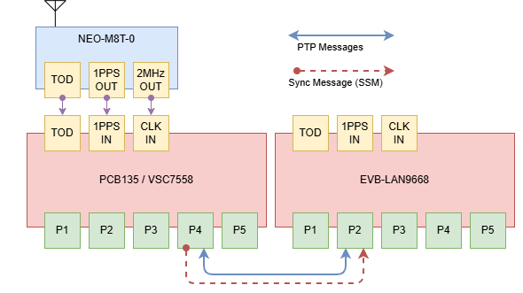

# PTP P2P Transparent Clock Demo


## 1 Objective

Demonstrate a GNSS-referenced PTP transparent clock that distributes accurate time from DUT1 to DUT2.

## 2 Topology

The topology is NEO-M8T GNSS to PCB135 (DUT1), which acts as a GNSS-slaved transparent clock and grandmaster, then Ethernet PTP to EVB-LAN9668 (DUT2), which acts as a slave transparent clock.



The topology diagram is represented by the topology below.

```{ .text .no-copy }
NEO-M8T GNSS
  1PPS  ──► PCB135 io-pin 2  (3.3 V direct, NOT through RS-422)
  NMEA  ──► MAX485 ──► ttyS1 (RS-422, 9600 8N1)
  2 MHz ──► CLK_IN           (SyncE reference)

PCB135 (DUT1)                    EVB-LAN9668 (DUT2)
P2P Transparent Clock            P2P Transparent Clock
GNSS-disciplined                 SyncE from DUT1

    Gi 1/4 ──── Cat 5e ──────────── Gi 1/2
```

---

## 3 PCB135 (DUT1) Configuration

Log-in as Admin to PCB135 using **`ICLI`**, then configure the following:

!!! tip

	Clear all switch configuration back to default but keep the switch's IP address
	```console
	# reload defaults keep-ip force
	```

```console
# configure terminal
```

```console
(config)# ! SyncE — 2 MHz from GNSS
(config)# network-clock input-source 2048khz
(config)# network-clock output-source 2048khz
(config)# network-clock clk-source 3 nominate clk-in
(config)# network-clock clk-source 3 ssm-overwrite prc
(config)# network-clock selector manual clk-source 3

(config)# ! PTP — P2P transparent clock
(config)# ptp 0 mode p2ptransparent onestep ethernet twoway vid 1 0 profile ieee1588 mep 1
(config)# ptp 0 filter-type basic
(config)# ptp 0 virtual-port mode pps-in 2 pps-delay 5
(config)# ptp 0 virtual-port tod ser proto rmc
(config)# ptp rs422 baudrate 9600 parity none wordlength 8 stopbits 1 flowctrl none

(config)# ! PTP Port Configuration on Gi 1/4
(config)# interface GigabitEthernet 1/4
(config-if)# network-clock synchronization ssm
(config-if)# ptp 0
(config-if)# ptp 0 announce interval 1 timeout 3
(config-if)# ptp 0 sync-interval 0
(config-if)# ptp 0 delay-mechanism p2p
(config-if)# ptp 0 delay-req interval 0
(config-if)# exit
(config)# exit
```

---

## 4 EVB-LAN9668 (DUT2) Configuration

Log-in as Admin to EVB-LAN9668 using **`ICLI`**, then configure the following:

!!! tip

	Clear all switch configuration back to default but keep the switch's IP address
	```console
	# reload defaults keep-ip force
	```

```console
# configure terminal
```

```console
(config)# ! SyncE — from DUT1 via Gi 1/2
(config)# network-clock clk-source 1 nominate interface GigabitEthernet 1/2
(config)# network-clock selector manual clk-source 1

(config)# ! PTP — P2P transparent clock
(config)# ptp 0 mode p2ptransparent onestep ethernet twoway vid 1 0 profile ieee1588 mep 1
(config)# ptp 0 filter-type basic

(config)# ! PTP Port Configuration on Gi 1/2
(config)# interface GigabitEthernet 1/2
(config-if)# network-clock synchronization ssm
(config-if)# ptp 0
(config-if)# ptp 0 announce interval 1 timeout 3
(config-if)# ptp 0 sync-interval 0
(config-if)# ptp 0 delay-mechanism p2p
(config-if)# ptp 0 delay-req interval 0
(config-if)# exit
(config)# exit
```

---

## 5 Verification

### 5.1 PCB135, check GNSS lock:

```console
# show ptp 0 slave
```
```{ .text .no-copy }
Slave port  Slave state    Holdover(ppb)
----------  -------------  -------------
58          PHASE_LOCKED   N.A.
```

```console
# show ptp 0 current
```
```{ .text .no-copy }
stpRm  OffsetFromMaster    MeanPathDelay
-----  ------------------  ------------------
1       0.000,000,012,972   0.000,000,000,000
```
`stpRm=1`, one step removed from the GNSS grandmaster (virtual port). `OffsetFromMaster` should be single-digit to low-double-digit nanoseconds.

### 5.2 Both devices, check port state:

```console
show ptp 0 port-state
```
```{ .text .no-copy }
Port  Enabled  PTP-State  Internal  Link  Port-Timer  Vlan-forw  Phy-timestamper  Peer-delay
----  -------  ---------  --------  ----  ----------  ---------  ---------------  ----------
   2  TRUE     p2pt       FALSE     Up    In Sync     Forward    TRUE             OK
   4  TRUE     p2pt       FALSE     Up    In Sync     Forward    TRUE             OK
VirtualPort  Enabled  PTP-State  Io-pin
-----------  -------  ---------  ------
         58  TRUE     slve            2
```
Active ports show `p2pt`, `Link Up`, `Port-Timer: In Sync`, `Peer-delay: OK`. `VirtualPort 58` must be `slve`, not `lstn`.

**EVB-LAN9668** will show `FREERUN` for `show ptp 0 slave`, this is correct; it has no independent time reference.
```{ .text .no-copy }
Slave port  Slave state    Holdover(ppb)
----------  -------------  -------------
0           FREERUN        N.A.
```


---

## 6 Results

### 6.1 PCB135 (DUT1)

```{ .text .no-copy }
Slave port  Slave state    Holdover(ppb)
----------  -------------  -------------
58          PHASE_LOCKED   N.A.

stpRm  OffsetFromMaster    MeanPathDelay
-----  ------------------  ------------------
1       0.000,000,012,972   0.000,000,000,000

Port 2: p2pt  Link Up  Port-Timer: In Sync  Peer-delay: OK
Port 4: p2pt  Link Up  Port-Timer: In Sync  Peer-delay: OK
VirtualPort 58: slve  io-pin 2

one_tod_cnt        :           3718
one_pps_cnt        :          12066   (≈ 3.35 h uptime × 1 Hz ✓)
missed_one_pps_cnt :             35
missed_tod_rx_cnt  :           7624   (GNSS fix intermittent — antenna sky-view)
```

The GNSS virtual port is phase-locked, and the active P2P ports are in sync with valid peer-delay measurements. The approximately 13 ns offset reported on DUT1 is within the expected single- to low-double-digit nanosecond range. The 1PPS count is consistent with the reported uptime; the missed-pulse and missed-ToD counts indicate intermittent GNSS reception, most likely due to limited antenna sky view, rather than a PTP forwarding problem.

### 6.2 EVB-LAN9668 (DUT2)

```{ .text .no-copy }
Slave port 0  FREERUN  (expected — no GNSS reference on DUT2)

Port 2: p2pt  Link Up  Port-Timer: In Sync  Peer-delay: OK
```

DUT2 is forwarding PTP as a transparent clock and has no independent GNSS or PTP slave servo, so `FREERUN` is expected. Its link, timer, and peer-delay states confirm that the P2P exchange is operational. Time accuracy at a downstream endpoint is obtained from the corrected PTP messages and the SyncE frequency reference, rather than from a `PHASE_LOCKED` state on DUT2 itself.

---

## 7 Notes

**Why both devices are transparent clocks, not boundary clocks:**
A transparent clock passes PTP frames unchanged except for correcting the switch residence time. Unlike a boundary clock, it does not re-originate timestamps. A chain of transparent clocks adds less error than a chain of boundary clocks, because each TC adds only a small, hardware-measured residence time correction.

**Why GNSS disciplines a transparent clock:**
PCB135's virtual port locks to the GNSS 1PPS. The TC's own time tracks GPS. When the hardware measures frame residence time it uses the switch LTC, which is GNSS-accurate. The resulting correction field is therefore computed against a GNSS-quality time base, giving a downstream slave a more accurate `correctionField` than a free-running TC would provide.

**SyncE chain:**
The 2 MHz input to PCB135 propagates frequency lock via Ethernet to EVB-LAN9668 (`network-clock clk-source 1 nominate interface GigabitEthernet 1/2`). This is independent of PTP; SyncE distributes frequency accuracy, while PTP distributes phase/time.
