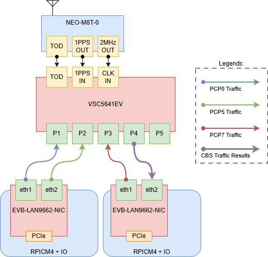
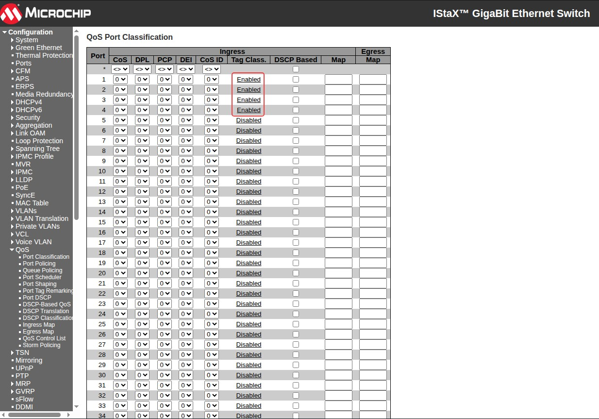
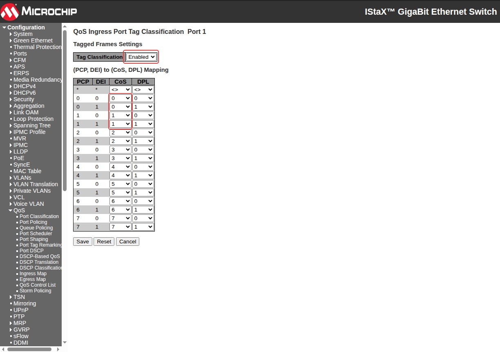
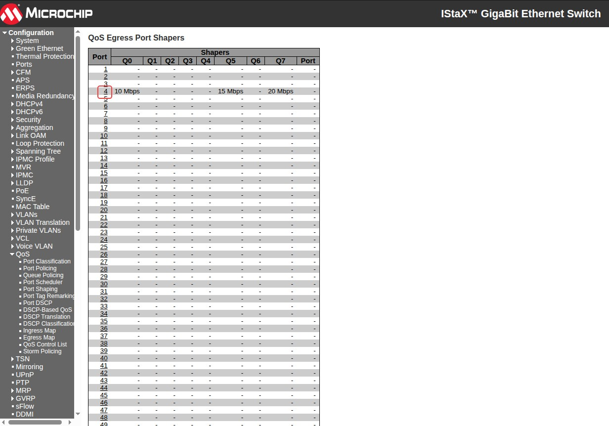
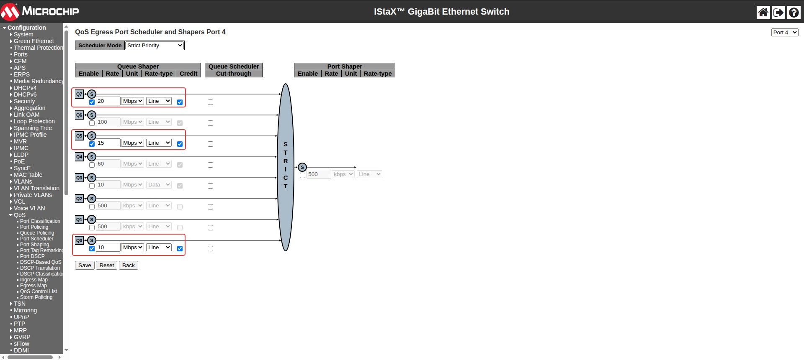
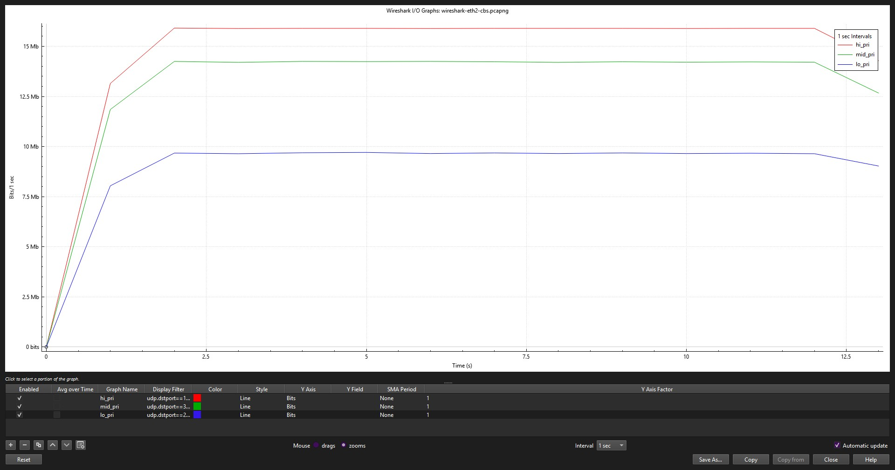

# TSN Credit-Based Shaper (CBS)

## 1 Objective

Verify that IEEE 802.1Qav Credit-Based Shaping (CBS) on the TSN switch enforces independent, per-queue bandwidth limits (idle slopes) on a single contended egress port, and that each priority class is capped at its own configured rate rather than at a shared or priority-ordered limit.

With three priority classes (low, medium, high) each offered at 900 Mbps into a single 1 Gbps egress port, confirm that:
- Each queue settles at its own configured shaper rate, not at a rate set by strict priority order
- All three classes stay present and interleaved in the shaped output, not time-multiplexed into separate windows
- The shaped egress rate stays within the sum of the configured per-queue caps

## 2 Test Topology



- **End Point 1 RPi + LAN9662 (EP1)**
    - Port 1: transmits low-priority stream (PCP 0), connected to switch port **Gi1/1**
    - Port 2: transmits medium-priority stream (PCP 5), connected to switch port **Gi1/2**
- **End Point 2 RPi + LAN9662 (EP2)**
    - Port 1: transmits high-priority stream (PCP 7), connected to switch port **Gi1/3**
    - Port 2: receives merged/shaped traffic, Wireshark capture point, connected to switch port **Gi1/4**
- **TSN Switch (VSC5641EV)**
    - All three talker streams ingress on Gi1/1 to Gi1/3 and egress toward EP2 Port 2 through the shaped port, Gi1/4
## 3 Traffic Generator Configuration

Use the `tsn-traffic-gen` application described in [Generating a Traffic Stream](tsn-traffic-generator.md) to load and run the following configurations. Start the generator on both end points only after the ports, templates, and streams have been reviewed in the TUI.

The UDP destination port is used as the Wireshark filter to distinguish each captured priority class: `10001` for high, `20001` for low, and `30001` for medium. The corresponding UDP source ports are `10000`, `20000`, and `30000`.

All three streams are sent to the same destination MAC address, the MAC of EP2 Port 2.

### 3.1 EP1 Low and Medium Priority Talkers

Save the following configuration as `tsn-demo-config.ini` on EP1:

```ini
[global]
latency_max_ns=200000
measure_ooo=true
stats_samples=100
test_id=42
sync_port=45900
sync_lead_ms=150

[port]
name=tx
interface=eth1
disabled=false

[port]
name=tx0
interface=eth2
disabled=false

[template]
name=lo_pri
port=tx
header_stack=mac,vlan,ip,udp
vlan_enabled=true
vlan_id=1
vlan_pcp=0
ip_dscp=0
ip_ttl=64
udp_src_port=20000
udp_dst_port=20001
data_fill=random

[template]
name=mid_pri
port=tx0
header_stack=mac,vlan,ip,udp
vlan_enabled=true
vlan_id=1
vlan_pcp=5
ip_dscp=0
ip_ttl=64
udp_src_port=30000
udp_dst_port=30001
data_fill=random

[stream]
name=stream_lo
id=2
port=tx
tx_template=lo_pri
mbps=900
pps=0
packet_size=1000
packet_count=0
disabled=false

[stream]
name=stream_mid
id=3
port=tx0
tx_template=mid_pri
mbps=900
pps=0
packet_size=1000
packet_count=0
disabled=false
```

Load it from the `tsn-traffic-gen` repository root:

```bash
sudo ./tsn-traffic-gen -c tsn-demo-config.ini
```
### 3.2 EP2 High Priority Talker

Save the following configuration as `tas-demo-config.ini` on EP2:

```ini
[global]
latency_max_ns=200000
measure_ooo=true
stats_samples=100
test_id=42
sync_port=45900
sync_lead_ms=150

[port]
name=tx
interface=eth1
disabled=false

[port]
name=tx0
interface=eth2
disabled=false

[template]
name=hi_pri
port=tx
header_stack=mac,vlan,ip,udp
vlan_enabled=true
vlan_id=1
vlan_pcp=7
ip_dscp=0
ip_ttl=64
udp_src_port=10000
udp_dst_port=10001
data_fill=random

[stream]
name=stream_hi
id=1
port=tx
tx_template=hi_pri
mbps=900
pps=0
packet_size=1000
packet_count=0
disabled=false
```

Load it from the `tsn-traffic-gen` repository root:

```bash
sudo ./tsn-traffic-gen -c tas-demo-config.ini
```

### 3.3 Synchronized Start and Stop

Both generator instances use the same `test_id`, `sync_port`, and `sync_lead_ms`, allowing EP1 to control a synchronized test:

PTP is not required for CBS credit accounting itself; it is used here to align the two traffic-generator instances and make timestamps from separate hosts comparable. Use the setup and pass criteria in [TSN Precision Time Protocol (802.1AS/gPTP)](tsn-ptp-(802.1as)-demo.md) before relying on synchronized launch times.

1. Synchronize the system clocks on EP1 and EP2 as described in [TSN Precision Time Protocol (802.1AS/gPTP)](tsn-ptp-(802.1as)-demo.md), and confirm that UDP broadcast traffic on port `45900` can pass between them.
2. Load both configurations and leave both TUIs running.
3. Start the Wireshark capture on EP2 Port 2.
4. On EP1, press uppercase `S` or select **Sync** to enable the Sync latch.
5. On EP1, press lowercase `s` or select **Start**. EP1 broadcasts the command through its first configured port (`eth1`), and both instances schedule transmission for the same target time, 150 ms later.
6. When the test interval is complete, leave the Sync latch enabled and press `s` or select **Stop** on EP1 to schedule a synchronized stop on both instances.

!!! info

	Clear all switch configuration back to default but keep the switch's IP address
	```console
	# reload defaults keep-ip force
	```
	**Apply the [802.1AS/gPTP Configuration](tsn-ptp-%28802.1as%29-demo.md#6-tsn-switch-configuration-vsc5641ev)**
## 4 TSN Switch Configuration (VSC5641EV)

### 4.1 QoS Requirement, Tag Classification

Apply Tag Classification

In the web, navigate to QoS → Port Classification and configure the following:





Apply on all three talker-facing ingress ports (Gi1/1 to Gi1/3). `qos trust tag` alone is not enough: the default PCP-to-queue mapping on this switch does not map PCP 0 to queue 0 or PCP 1 to queue 1, so those two mappings need an explicit `qos map tag-cos` line each, for example on Gi1/1:

In **`ICLI`**, the configuration is as follows:

```console
# configure terminal
(config)# interface GigabitEthernet 1/1
(config-if)# qos trust tag
(config-if)# qos map tag-cos pcp 0 dei 0 cos 0 dpl 0
(config-if)# qos map tag-cos pcp 0 dei 1 cos 0 dpl 1
(config-if)# qos map tag-cos pcp 1 dei 0 cos 1 dpl 0
(config-if)# qos map tag-cos pcp 1 dei 1 cos 1 dpl 1
(config-if)# exit
#
(config)# interface GigabitEthernet 1/2
(config-if)# qos trust tag
(config-if)# qos map tag-cos pcp 0 dei 0 cos 0 dpl 0
(config-if)# qos map tag-cos pcp 0 dei 1 cos 0 dpl 1
(config-if)# qos map tag-cos pcp 1 dei 0 cos 1 dpl 0
(config-if)# qos map tag-cos pcp 1 dei 1 cos 1 dpl 1
(config-if)# exit
#
(config)# interface GigabitEthernet 1/3
(config-if)# qos trust tag
(config-if)# qos map tag-cos pcp 0 dei 0 cos 0 dpl 0
(config-if)# qos map tag-cos pcp 0 dei 1 cos 0 dpl 1
(config-if)# qos map tag-cos pcp 1 dei 0 cos 1 dpl 0
(config-if)# qos map tag-cos pcp 1 dei 1 cos 1 dpl 1
(config-if)# exit
#
(config)# interface GigabitEthernet 1/4
(config-if)# qos trust tag
(config-if)# qos map tag-cos pcp 0 dei 0 cos 0 dpl 0
(config-if)# qos map tag-cos pcp 0 dei 1 cos 0 dpl 1
(config-if)# qos map tag-cos pcp 1 dei 0 cos 1 dpl 0
(config-if)# qos map tag-cos pcp 1 dei 1 cos 1 dpl 1
(config-if)# exit
```

The same four `qos map tag-cos` lines go on Gi1/2 and Gi1/3 as well, since all three talker ports need the same PCP-to-queue mapping. With this in place, low (PCP 0) goes to queue 0, medium (PCP 5) and high (PCP 7) go to queue 5 and queue 7 as expected without needing an explicit map, since PCP 5 and PCP 7 already map to their matching queue by default. Without `trust tag`, every stream lands in queue 0 and the three classes collapse together before reaching Gi1/4. `trust tag` and these maps are only needed on the ingress ports; Gi1/4 only sends traffic out in this test, so it does not need them.

### 4.2 Credit-Based Shaper (CBS) Configuration

In the web, navigate to QoS → Port Shaping and configure the following:





CBS is configured on the egress port, Gi1/4. This is the current, live config on the switch, confirmed with `show running-config interface GigabitEthernet 1/4`:

In **`ICLI`**, the configuration is as follows:

```console
# configure terminal
(config)# interface GigabitEthernet 1/4
(config-if)# switchport hybrid egress-tag all
(config-if)# qos queue-shaper queue 0 10 mbps credit
(config-if)# qos queue-shaper queue 5 15 mbps credit
(config-if)# qos queue-shaper queue 7 20 mbps credit rate-type data
(config-if)# end
```

| Priority | PCP | Queue | Shaper rate | Rate-type |
| -------- | --- | ----- | ----------- | --------- |
| Low      | 0   | 0     | 10 Mbps     | line      |
| Medium   | 5   | 5     | 15 Mbps     | line      |
| High     | 7   | 7     | 20 Mbps     | line      |

`rate-type` controls whether the shaper counts the roughly 20-byte preamble/gap overhead per frame (`line`, the default) or leaves it out (`data`). For 1000-byte payloads that is only about a 2% difference, small enough that it does not change the results below. It is called out here only because queue 7 is set differently from queues 0 and 5 in the live config.

Each `qos queue-shaper queue <n> <rate> credit` line sets that queue's allowed long-run rate. While the queue has traffic queued, it spends credit at that rate, capping its output no matter how much is offered to it.

## 5 Expected Behavior

**Check the ingress rate first**, before looking at the egress rate. A queue's shaped output only proves anything if that queue was actually offered more than its cap. Steps, per queue under test:

1. Clear counters on the talker's ingress port and on Gi1/4:
    ```console
    # clear statistics interface GigabitEthernet 1/3 
    # clear statistics interface GigabitEthernet 1/4
    ```
2. Let traffic run for a fixed, known duration (15 seconds is enough), then read both counters in the same way, again bracketed with `date`:
    ```console
    # show interface GigabitEthernet 1/3 statistics priority 7
    # show interface GigabitEthernet 1/4 statistics priority 7
    ```
3. Take the ingress port's Rx count for that priority, divide by the elapsed seconds between the two `date` calls, and convert to Mbps (roughly frames/sec times 8400 bits/frame for 1000-byte payloads).
4. Compare that ingress rate to the queue's configured cap:
    - If ingress is **above** the cap, the queue's egress rate is a real test of the shaper, proceed to compare egress against cap as in the rounds below.
    - If ingress is **at or below** the cap, stop, the shaper has nothing to do here. Either raise the traffic generator's rate for that stream, or lower the queue's shaper cap below the observed ingress rate, then repeat from step 1. Do not read the egress number as a pass or fail in this case.

Once ingress is confirmed above the cap, compare the egress (shaped) count from the same window against the cap:

1. Low (queue 0) should settle near 10 Mbps
2. Medium (queue 5) should settle near 15 Mbps
3. High (queue 7) should settle near 20 Mbps, but only if it is actually offered more than 20 Mbps in that window
4. All three classes present at the same time, not gated into separate windows
5. Combined egress rate should approach but not exceed 45 Mbps (10 + 15 + 20) once all three queues are saturated

## 6 Results

Instead of relying only on a downstream Wireshark capture, each round below reads the switch's own counters directly: ingress counters on the talker port (what was offered, before the switch does anything) and egress counters on Gi1/4 (what actually got shaped out). Each round clears the counters, waits a known amount of time, then reads them, with the clear and the read timestamped in the same shell command so the window length is known exactly instead of assumed.

### 6.1 Round 1, caps 10 / 20 / 60 Mbps (queue 7 cap above what the talker actually sends)

| Queue | Ingress (offered) | Egress (shaped) | Cap | % of cap |
|---|---|---|---|---|
| Low (0) | ~102.1 Mbps | ~10.4 Mbps | 10 Mbps | 104% |
| Medium (5) | ~102.3 Mbps | ~20.1 Mbps | 20 Mbps | 101% |
| High (7) | ~35.1 Mbps | ~34.1 Mbps | 60 Mbps | 57% |

Low and medium are offered around 102 Mbps and both clamp to within about 4% of their caps, a clean pass. High's ingress and egress are almost identical (35.1 to 34.1 Mbps), meaning the queue passes through basically unshaped. That is because the talker itself never sends more than about 35 Mbps, well under the 60 Mbps cap, so the shaper has nothing to do. The low 57% number reflects that the talker did not offer enough load, not a shaping problem.

### 6.2 Round 2, caps 10 / 15 / 20 Mbps (queue 7 cap now below what the talker sends)



| Queue | Ingress (offered) | Egress (shaped) | Cap | % of cap |
|---|---|---|---|---|
| Low (0) | ~101.1 Mbps | ~10.4 Mbps | 10 Mbps | 104% |
| Medium (5) | ~101.3 Mbps | ~15.3 Mbps | 15 Mbps | 102% |
| High (7) | ~43.9 Mbps | ~17.3 Mbps | 20 Mbps | 87% |

With the queue 7 cap lowered to 20 Mbps, below the talker's offered rate in this window (about 43.9 Mbps), the shaper now clamps the queue down to about 17.3 Mbps, the same active-shaping behavior seen on low and medium. This confirms Round 1's shortfall was simply because the talker was not offering enough load, not a switch problem: lowering the cap below the offered rate is enough to reproduce the same clamping seen on the other two queues.

**High talker is bursty.** Across consecutive ~15 second windows, with nothing changed on the traffic generator, the high talker's own ingress rate measured about 4.5 Mbps, then 35 Mbps, then 43.9 Mbps. The high-priority talker (EP2 Port 1) and the Wireshark capture point (EP2 Port 2) are the same RPi and LAN9662 box, so it is likely CPU-limited by sharing that box with the capture process, which would explain the bursty rather than steady output. This matches the packet-timing jitter seen in the original capture, where queue 7's spacing was about twice as jittery as low and medium's, a sign of raw, unsmoothed talker output rather than a shaper-metered cadence.
