# TSN Per-Stream Filtering and Policing (PSFP)

## 1 Objective

In shared network environments, misbehaving traffic sources can disrupt other applications. For example, when a client generates excessive traffic that exceeds available bandwidth, it can disrupt traffic from other clients sharing the same network infrastructure.

This problem is particularly critical in Time-Sensitive Networking (TSN) environments where predictable and reliable communication is essential for real-time applications. Per-stream filtering and policing provides an effective solution by limiting excessive traffic and protecting well-behaved streams from disruption, ensuring fair resource allocation across different streams.

This showcase demonstrates per-stream policing in TSN using a token bucket mechanism. Token bucket policing provides a deterministic method for traffic control that enforces long-term bandwidth limits while allowing controlled short-term traffic bursts. The scenario implements two clients: one generating excessive traffic and another generating normal traffic. We show how token bucket policing effectively limits the excessive traffic while allowing normal traffic to flow unimpeded.

## 2 Background

Per-Stream Filtering and Policing (PSFP), as defined in the IEEE 802.1Qci standard, provides filtering, policing and service class selection for a stream.

A PSFP stream filter references sub-components to make up the entire stream filter. Sub-components are:

- a mandatory stream or stream collection,
- an optional flow meter that defines the policing behaviour, and
- an optional stream gate that defines when the gate towards the egress queues is open and closed.

A stream or stream collection may only be referenced by one stream filter.
Both flow meters and stream gates may be referenced by more than one stream filter.

## 3 Test Topology

The network consists of two end-points devices that send traffic streams to another end-point through a TSN switch:

- EP1: Generates misbehaving traffic with varying, sometimes excessive data rates
- EP2: Generates well-behaved traffic with a steady data rate
- TSN Switch: Implements token bucket policing to control traffic flows
- EP3: Receives traffic from both clients

The combined traffic from both clients occasionally exceeds the link capacity between the switch and the server, creating congestion. This scenario allows us to compare network behavior with and without token bucket policing enabled in the switch.

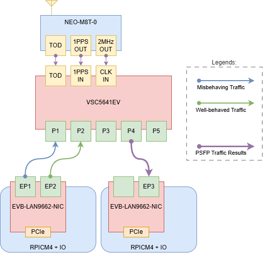

## 4 Traffic Generator Configuration

Use the `tsn-traffic-gen` application described in [Generating a Traffic Stream](tsn-traffic-generator.md) to load and run the following configuration. Review the ports, templates, and streams in the TUI before starting transmission.

`stream_lo` represents EP1's misbehaving traffic and uses a sinusoidal rate. `stream_mid` represents EP2's well-behaved traffic and uses a constant bit rate. Replace the `dst_mac` value in both templates with the MAC address of EP3's receiving interface if it differs from the address shown.

Save the following configuration as `psfp-demo-config.ini`:

```ini
[global]
latency_max_ns=200000
measure_ooo=true
stats_samples=100
test_id=42
sync_port=45900
sync_lead_ms=150

[port]
name=tx
interface=eth1
disabled=false

[port]
name=tx0
interface=eth2
disabled=false

[template]
name=lo_pri
port=tx
dst_mac=7a:51:93:bc:8f:92
header_stack=mac,vlan,ip,udp
vlan_enabled=true
vlan_id=1
vlan_pcp=0
ip_dscp=0
ip_ttl=64
udp_src_port=20000
udp_dst_port=20001
data_fill=random

[template]
name=mid_pri
port=tx0
dst_mac=7a:51:93:bc:8f:92
header_stack=mac,vlan,ip,udp
vlan_enabled=true
vlan_id=1
vlan_pcp=5
ip_dscp=0
ip_ttl=64
udp_src_port=30000
udp_dst_port=30001
data_fill=random

[stream]
name=stream_lo
id=2
port=tx
tx_template=lo_pri
mbps=20
pattern=sinusoid
sine_amplitude_pct=50
sine_period_ms=5000
packet_size=1000
packet_count=0
disabled=false

[stream]
name=stream_mid
id=3
port=tx0
tx_template=mid_pri
mbps=20
pattern=cbr
packet_size=1000
packet_count=0
disabled=false

```

Load it from the `tsn-traffic-gen` repository root:

```bash
sudo ./build/tsn-traffic-gen -c psfp-demo-config.ini
```

### 4.1 Synchronized Start and Stop

Both talker streams run in this single generator instance, so they already share one system clock. The `test_id`, `sync_port`, and `sync_lead_ms` settings allow the Sync latch to schedule them for the same target time and keep the operating procedure consistent with the multi-host demos:

1. Load the configuration and leave the TUI running.
2. Start the Wireshark capture on EP3.
3. Press uppercase `S` or select **Sync** to enable the Sync latch.
4. Press lowercase `s` or select **Start**. Both streams are scheduled to start 150 ms later.
5. When the capture interval is complete, leave the Sync latch enabled and press `s` or select **Stop** to schedule both streams to stop together.

If additional generator instances join the test, give them the same synchronization settings, synchronize their system clocks using [TSN Precision Time Protocol (802.1AS/gPTP)](tsn-ptp-(802.1as)-demo.md), and allow UDP broadcast traffic on port `45900` between the hosts.

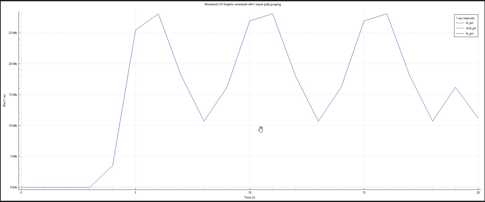
*Graph that shows the input of the misbehaving traffic.*
## 5 Streams and Stream Collections
A stream is an ingress property, where a subset of traffic gets identified by certain frame properties, such as DMAC, SMAC, VLAN tags, and layer 3 properties.

Streams are used by two other TSN protocols described later. One is Per-Stream Filtering and Policing and the other is Frame Replication and Elimination for Reliability.

Multiple streams can be bundled into a stream collection, which may be used in both PSFP and FRER, as we shall see later.

### 5.1 Stream Configuration
A stream is essentially a set of matching criteria.A frame belongs to the stream only if all configured criteria match.

For example:
```{ .text .no-copy }
stream 10
    dmac 01:02:03:04:05:06
    ipv4 dport 20001
```

A frame must match both:
- Destination MAC = `01:02:03:04:05:06`
- Destination Port = `20001`

to be classified into Stream 10.

**In this demo**:

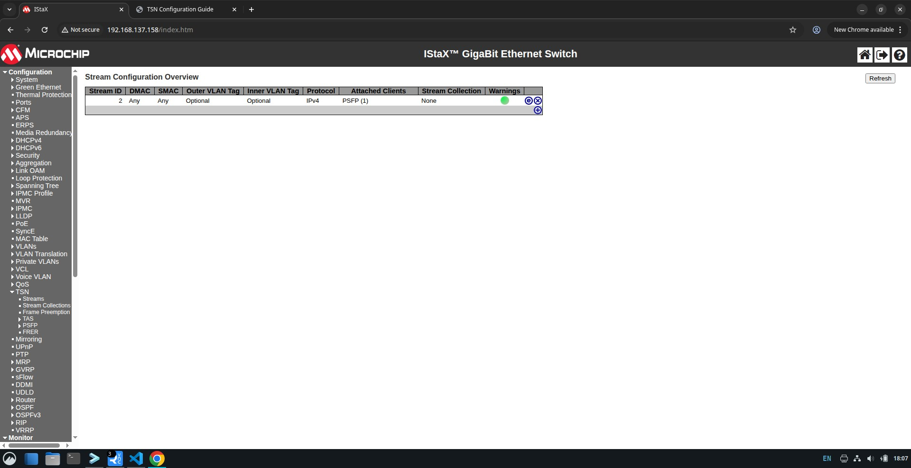

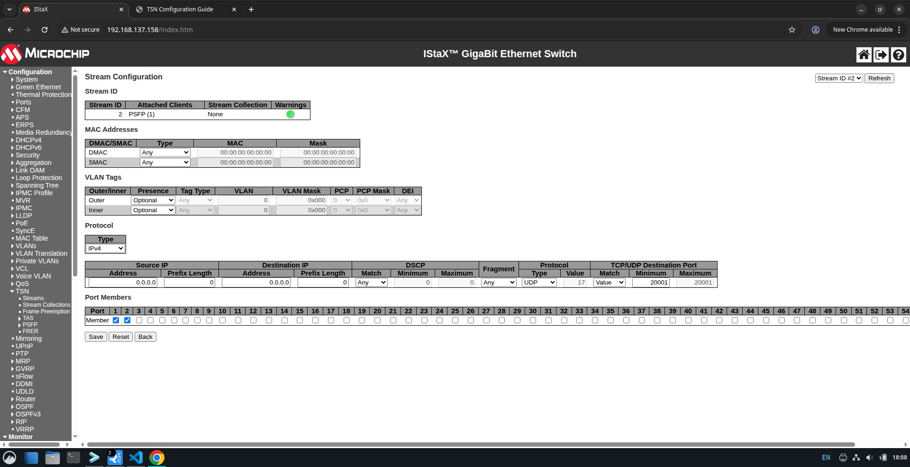

The running-config defines one stream:

```console
# configure terminal
(config)# stream 2
(config-stream)# ipv4 proto udp dport 20001
(config-stream)# end
```

- **Stream 2** (UDP dport 20001) matches `stream_lo`'s `lo_pri` template , this is EP1's misbehaving sinusoid traffic. It is the stream referenced by `tsn stream filter 1`, so it is the one being policed and gated in this demo.
- `stream_mid`'s `mid_pri` template uses UDP dport 30001, which does not match Stream 2. EP2's well-behaved traffic therefore never gets classified into a PSFP stream at all, so it never enters the PSFP pipeline , it is forwarded purely on its QoS/PCP marking. This is what makes it the "unimpeded" traffic referenced in the Objective.
- GigabitEthernet 1/1 and 1/2 also apply `stream-id 1` at the interface, and 1/3 applies `stream-id 1` as well, but no `stream 1` block exists at the global level in this running-config , that binding is a leftover reference with nothing to match against, so it has no effect here. The `stream-id 2` binding on 1/1 and 1/2 is what actually activates Stream 2 classification at ingress.

### 5.2 Stream Collection Configuration
A Stream Collection groups streams together.
Instead of configuring filters for each stream individually:

```{ .text .no-copy }
Stream 1
Stream 2
Stream 3
```

you can make:

```{ .text .no-copy }
stream-collection 1
stream-id-list 1,2,3
```

and apply one PSFP filter to the collection.

**In this demo**, stream collections are not used , the running-config has no `stream-collection` block, and `tsn stream filter 1` references Stream 2 directly by `stream-id`.

## 6 Flow Meter Configuration

**CIR (Committed Information Rate)**
- The guaranteed traffic rate that a stream is allowed to send.
- Measured in kbps.
- Traffic within the CIR is considered green (compliant).
- Example:
 cir 10000 = 10 Mbps of committed bandwidth.

**CBS (Committed Burst Size)**
- The maximum burst of traffic that can be sent at once while still being considered - within the committed rate.
- Measured in bytes.
- Represents the size of the committed token bucket.
Example:
 A CIR of 10 Mbps with a CBS of 100 KB allows short bursts up to 100 KB without being penalized.

**EIR (Excess Information Rate)**
- Additional bandwidth allowed beyond the CIR.
- Measured in kbps.
- Traffic exceeding CIR may still be accepted as yellow traffic if excess tokens are available.
- Example:
CIR = 10 Mbps
EIR = 5 Mbps
The flow can use up to 15 Mbps temporarily if excess capacity is available.

**EBS (Excess Burst Size)**
- Maximum burst size allowed for traffic above the CIR.
- Measured in bytes.
- Represents the size of the excess token bucket.
- Example:
 A flow may temporarily exceed the CIR using tokens from the excess bucket up to the EBS limit.

**coupling-flag**
- Controls interaction between the committed (CBS) and excess (EBS) buckets.
- When enabled, unused committed bandwidth can help fill the excess bucket.
- Traffic that would overflow the committed bucket can be added to the excess bucket instead, provided the excess bucket is not full.

**color-mode**
- Determines whether the meter is color-blind or color-aware.
- Disabled (no color-mode) = Color-Blind = ignore previous markings
    - Every incoming frame starts as green.
    - The meter alone decides whether it remains green, becomes yellow, or becomes red.
- Enabled (color-mode) = honor previous markings.
    - Incoming frames already carry a color indication (derived from the VLAN DEI bit).
    - The meter takes that existing color into account.

**drop-on-yellow**
- Determines what happens to yellow frames.
- Disabled (no drop-on-yellow)
    - Yellow frames are forwarded.
    - Their DEI (Drop Eligible Indicator) is set to 1, meaning they are more likely to be dropped during congestion.
- Enabled (drop-on-yellow)
    - Yellow frames are immediately discarded.

**mark-red-enable**
- Controls a protection mechanism for severe traffic violations.
- Disabled
    - Red frames are dropped individually.
- Enabled
    - If a red frame is detected, the meter enters a state where all subsequent frames are discarded until the condition is cleared.
- This is useful in TSN environments where a stream that exceeds its contract may indicate a fault or misbehaving device.

**In this demo**:

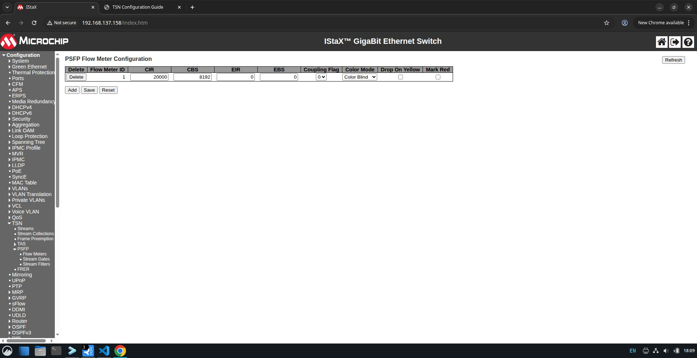

```console
# configure terminal
(config)# tsn flow meter 1
(config-flow-meter)# cir 20000
(config-flow-meter)# cbs 8192
(config-flow-meter)# end
```

- **CIR = 20000 kbps (20 Mbps)** , matches the mean rate of `stream_lo` in the traffic generator (`mbps=20`), so the meter's committed rate is set to exactly the average rate the misbehaving stream targets before its sinusoidal swings push it up to ~30 Mbps and down to ~10 Mbps.
- **CBS = 8192 bytes (8 KB)** , about eight of `stream_lo`'s 1000-byte packets, giving a small amount of burst tolerance before excess traffic is penalized.
- **EIR / EBS**: not configured , there is no excess (yellow) bucket, so nothing above the CIR ever qualifies as yellow.
- **coupling-flag**: not configured , not used in this demo.
- **color-mode**: not configured , the meter is color-blind (default); it ignores any pre-existing DEI marking and evaluates every frame as green on arrival.
- **drop-on-yellow**: not applicable here since EIR/EBS are unset, so no yellow frames are ever produced.
- **mark-red-enable**: not configured , red (non-conforming) frames are dropped individually; a single violation does not shut the meter down for subsequent frames.

## 7 Stream Gate Configuration
A Stream Gate in IEEE 802.1Qci PSFP acts like a time-based traffic gate. It controls when a stream is allowed to pass and can optionally change priority or block streams that violate rules.

It is a programmable traffic light for TSN streams, where the Control List defines when the light is red (closed) or green (open), and optionally which priority lane the traffic should use.

**state**
- Defines the gate's initial state.
- state open
    - Frames are allowed through the gate.
- state closed
    - Frames are blocked by the gate.

**ipv (Internal Priority Value)**
- Specifies the internal forwarding priority (queue) for frames that pass through the gate.
- ipv 0-7
    - Overrides the frame's existing priority.
    - Maps the frame to a specific egress queue.
- no ipv
    - Keeps the frame's original priority.

**close-due-to-invalid-rx-enable**
- Protects against traffic arriving when the gate should be closed.
- Disabled
    - Frames received while the gate is closed are simply dropped.
- Enabled
    - If any frame arrives during a closed interval, the gate is permanently closed until reconfigured.
- Use case: Detect rogue or malfunctioning devices that transmit outside their assigned time slot.

**close-due-to-octets-exceeded-enable**
- Protects against oversized frames.
- Disabled
    - Frames exceeding octet-max are handled normally.
- Enabled
    - If a frame larger than the configured octet-max passes through, the gate permanently closes.
- Use case: Prevent a stream from consuming more bandwidth than expected.

**cycle-time**
- Defines the total duration of one gate schedule cycle.

**control-list-length (GCL Length)**
- Defines how many entries exist in the Gate Control List (GCL).

**control-list (GCL)**
- The Gate Control List (GCL) is the actual schedule executed by the gate.

**time-interval**
- Duration of the entry.

**config-change**
- A one-shot command that tells the hardware to apply the pending schedule.

**In this demo**:

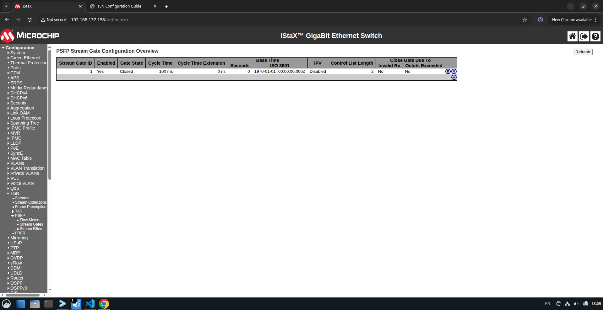

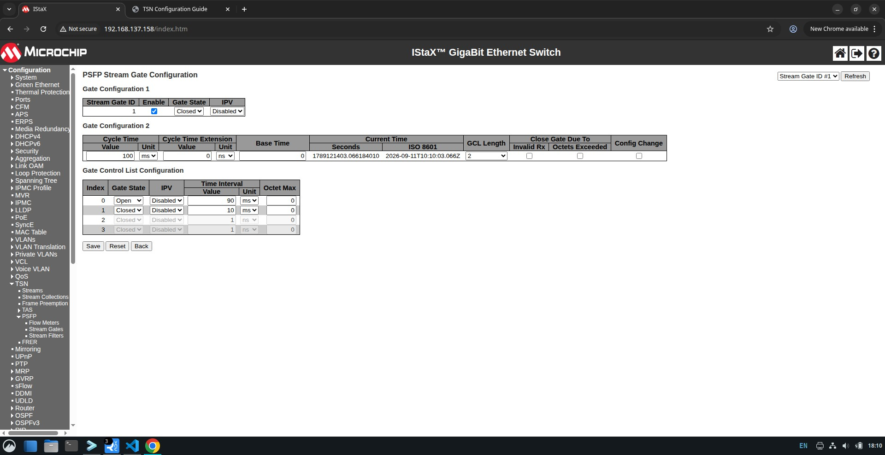

```console
# configure terminal
(config)# tsn stream gate 1
(config-stream-gate)# cycle-time 100 ms
(config-stream-gate)# control-list-length 2
(config-stream-gate)# control-list index 0 gate-state open time-interval 90 ms
(config-stream-gate)# control-list index 1 gate-state closed time-interval 10 ms
(config-stream-gate)# enable
(config-stream-gate)# config-change
(config-stream-gate)# end
```

- **cycle-time = 100 ms** with a **2-entry GCL**: index 0 keeps the gate open for 90 ms, index 1 closes it for 10 ms, repeating every cycle. This is a **90% duty cycle** gate , independent of and in addition to whatever the flow meter decides.
- **ipv**: not configured on either GCL entry , the gate does not override the frame's priority; frames keep their original queue assignment.
- **close-due-to-invalid-rx-enable**: not configured , disabled. Frames arriving during the closed 10 ms window are simply dropped; the gate does not permanently latch closed.
- **close-due-to-octets-exceeded-enable**: not configured , disabled, not used in this demo.
- `enable` turns the gate on; `config-change` commits this admin schedule into the operational GCL that hardware executes.

The stream gate executes from the switch's local time base. The recurring 90/10 duty cycle can be observed on one switch without comparing absolute phase, but alignment with external talkers, listeners, or another scheduled bridge requires a shared clock. Use [TSN Precision Time Protocol (802.1AS/gPTP)](tsn-ptp-(802.1as)-demo.md) to establish and verify that time base before making cross-device phase claims. The flow meter's token-bucket operation does not itself require PTP.

## 8 Stream Filter Configuration
A Stream Filter in IEEE 802.1Qci PSFP is the component that links a stream to policing (Flow Meter) and scheduling (Stream Gate). Think of it as the "glue" that determines which stream is controlled and what actions are applied to it.

**stream-id**
- Associates the filter with a specific stream.

**stream-collection-id**
- Associates the filter with a stream collection (a group of streams).

**flow-meter id**
- Associates a previously configured Flow Meter with the filter.

**gate id**
- Associates a previously configured Stream Gate with the filter.

**max-sdu**
- Defines the maximum frame size allowed by the filter.
- SDU stands for Service Data Unit, which in this context is effectively the maximum frame size the stream is expected to send.

**In this demo**:

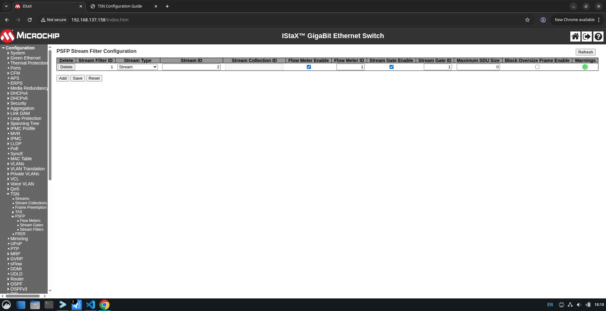

```console
# configure terminal
(config)# tsn stream filter 1
(config-stream-filter)# stream-id 2
(config-stream-filter)# flow-meter id 1
(config-stream-filter)# gate id 1
(config-stream-filter)# end
```

- **stream-id 2** , the filter is bound to Stream 2 (`stream_lo`'s traffic), not a stream collection.
- **flow-meter id 1** and **gate id 1** are both attached, so Stream 2 traffic passes through both policing (CIR 20 Mbps / CBS 8 KB) and gating (90 ms open / 10 ms closed) before reaching the egress queues.
- **max-sdu**: not configured , not used in this demo; frame size is not separately capped beyond what policing already implies.

## 9 TSN Configuration

This is the expected running-config for the configuration above.

```console
# show running-config
```
```{ .text .no-copy }
!
vlan 1-4095
!
!
!
!
spanning-tree mst name ca-69-dd-e9-bb-b9 revision 0
!
stream 2
 ipv4 proto udp dport 20001
!
no tsn tas always-guard-band
!
voice vlan oui 00-01-E3 description Siemens AG phones
voice vlan oui 00-03-6B description Cisco phones
voice vlan oui 00-0F-E2 description H3C phones
voice vlan oui 00-60-B9 description Philips and NEC AG phones
voice vlan oui 00-D0-1E description Pingtel phones
voice vlan oui 00-E0-75 description Polycom phones
voice vlan oui 00-E0-BB description 3Com phones
network-clock output-source 2048khz
network-clock ssm-holdover prc
network-clock ssm-freerun prc
network-clock clk-source 3 nominate clk-in
network-clock clk-source 3 aneg-mode master
network-clock clk-source 3 ssm-overwrite prc
network-clock input-source 2048khz
network-clock selector manual clk-source 3
ptp 0 mode boundary twostep ethernet twoway vid 1 0 profile 802.1as mep 1
 ptp 0 filter-type basic
 ptp 0 source-time-inaccuracy 0
 ptp 0 gm-time-inaccuracy 0
 ptp 0 dist-time-inaccuracy 0
ptp 0 virtual-port mode pps-in 2 pps-delay 5
ptp 0 virtual-port tod ser proto rmc
ptp rs422 baudrate 9600 parity none wordlength 8 stopbits 1 flowctrl none
!
interface GigabitEthernet 1/1
 stream-id 1
 stream-id 2
 qos trust tag
 qos map tag-cos pcp 0 dei 0 cos 0 dpl 0
 qos map tag-cos pcp 0 dei 1 cos 0 dpl 1
 qos map tag-cos pcp 1 dei 0 cos 1 dpl 0
 qos map tag-cos pcp 1 dei 1 cos 1 dpl 1
 network-clock synchronization ssm
 ptp 0 
 ptp 0 announce interval 0 timeout 3
 ptp 0 sync-interval -3
 ptp 0 delay-mechanism p2p
 ptp 0 delay-req interval 0
 ptp 0 delay-asymmetry 0
 ptp 0 ingress-latency 0
 ptp 0 egress-latency 0
 ptp 0 mcast-dest link-local
 ptp 0 mgtSettableLogSyncInterval -3
 ptp 0 mgtSettableLogAnnounceInterval 0
 ptp 0 mgtSettableLogPdelayReqInterval 0
 ptp 0 mgtSettableLogGptpCapableMessageInterval 0
 ptp 0 usemgtSettableLogSyncInterval 1
 ptp 0 usemgtSettableLogAnnounceInterval 1
 ptp 0 usemgtSettableLogPdelayReqInterval 1
 ptp 0 useMgtSettableLogGptpCapableMessageInterval 1
 ptp 0 gptp-interval 0
 ptp 0 force-as-capable path-delay 0 
!
interface GigabitEthernet 1/2
 switchport hybrid egress-tag all
 stream-id 1
 stream-id 2
 qos trust tag
 qos map tag-cos pcp 0 dei 0 cos 0 dpl 0
 qos map tag-cos pcp 0 dei 1 cos 0 dpl 1
 qos map tag-cos pcp 1 dei 0 cos 1 dpl 0
 qos map tag-cos pcp 1 dei 1 cos 1 dpl 1
 network-clock synchronization ssm
 ptp 0 
 ptp 0 announce interval 0 timeout 3
 ptp 0 sync-interval -3
 ptp 0 delay-mechanism p2p
 ptp 0 delay-req interval 0
 ptp 0 delay-asymmetry 0
 ptp 0 ingress-latency 0
 ptp 0 egress-latency 0
 ptp 0 mcast-dest link-local
 ptp 0 mgtSettableLogSyncInterval -3
 ptp 0 mgtSettableLogAnnounceInterval 0
 ptp 0 mgtSettableLogPdelayReqInterval 0
 ptp 0 mgtSettableLogGptpCapableMessageInterval 0
 ptp 0 usemgtSettableLogSyncInterval 1
 ptp 0 usemgtSettableLogAnnounceInterval 1
 ptp 0 usemgtSettableLogPdelayReqInterval 1
 ptp 0 useMgtSettableLogGptpCapableMessageInterval 1
 ptp 0 gptp-interval 0
 ptp 0 force-as-capable path-delay 0 
!
interface GigabitEthernet 1/3
 switchport hybrid egress-tag all
 stream-id 1
 qos trust tag
 qos map tag-cos pcp 0 dei 0 cos 0 dpl 0
 qos map tag-cos pcp 0 dei 1 cos 0 dpl 1
 qos map tag-cos pcp 1 dei 0 cos 1 dpl 0
 qos map tag-cos pcp 1 dei 1 cos 1 dpl 1
 network-clock synchronization ssm
 ptp 0 
 ptp 0 announce interval 0 timeout 3
 ptp 0 sync-interval -3
 ptp 0 delay-mechanism p2p
 ptp 0 delay-req interval 0
 ptp 0 delay-asymmetry 0
 ptp 0 ingress-latency 0
 ptp 0 egress-latency 0
 ptp 0 mcast-dest link-local
 ptp 0 mgtSettableLogSyncInterval -3
 ptp 0 mgtSettableLogAnnounceInterval 0
 ptp 0 mgtSettableLogPdelayReqInterval 0
 ptp 0 mgtSettableLogGptpCapableMessageInterval 0
 ptp 0 usemgtSettableLogSyncInterval 1
 ptp 0 usemgtSettableLogAnnounceInterval 1
 ptp 0 usemgtSettableLogPdelayReqInterval 1
 ptp 0 useMgtSettableLogGptpCapableMessageInterval 1
 ptp 0 gptp-interval 0
 ptp 0 force-as-capable path-delay 0 
!
interface GigabitEthernet 1/4
 switchport hybrid egress-tag all
 qos trust tag
 qos map tag-cos pcp 0 dei 0 cos 0 dpl 0
 qos map tag-cos pcp 0 dei 1 cos 0 dpl 1
 qos map tag-cos pcp 1 dei 0 cos 1 dpl 0
 qos map tag-cos pcp 1 dei 1 cos 1 dpl 1
 no spanning-tree
 network-clock synchronization ssm
 ptp 0 
 ptp 0 announce interval 0 timeout 3
 ptp 0 sync-interval -3
 ptp 0 delay-mechanism p2p
 ptp 0 delay-req interval 0
 ptp 0 delay-asymmetry 0
 ptp 0 ingress-latency 0
 ptp 0 egress-latency 0
 ptp 0 mcast-dest link-local
 ptp 0 mgtSettableLogSyncInterval -3
 ptp 0 mgtSettableLogAnnounceInterval 0
 ptp 0 mgtSettableLogPdelayReqInterval 0
 ptp 0 mgtSettableLogGptpCapableMessageInterval 0
 ptp 0 usemgtSettableLogSyncInterval 1
 ptp 0 usemgtSettableLogAnnounceInterval 1
 ptp 0 usemgtSettableLogPdelayReqInterval 1
 ptp 0 useMgtSettableLogGptpCapableMessageInterval 1
 ptp 0 gptp-interval 0
 ptp 0 force-as-capable path-delay 0 
!
interface vlan 1
 ip address 192.168.137.158 255.255.255.0
!
spanning-tree aggregation
 no spanning-tree
 spanning-tree link-type point-to-point
!
!
!
tsn flow meter 1
 cir 20000
 cbs 8192
!
tsn stream gate 1
 cycle-time 100 ms
 control-list-length 2
 control-list index 0 gate-state open time-interval 90 ms
 control-list index 1 gate-state closed time-interval 10 ms
 enable
 config-change
!
tsn stream filter 1
 stream-id 2
 flow-meter id 1
 gate id 1
!
end
#
```

## 10 Expected Behavior

- `stream_lo` (UDP dport 20001, mean 20 Mbps sinusoid swinging between ~10 Mbps and ~30 Mbps over a 5 s period) is classified into Stream 2, which is matched by `tsn stream filter 1` and therefore runs through both Flow Meter 1 and Stream Gate 1:
    - **Flow Meter 1** admits traffic as green up to the 20 Mbps CIR, with roughly 8 KB of burst headroom (CBS) before tokens run out. Once the sine wave pushes the instantaneous rate above ~20 Mbps for long enough to drain the bucket, further packets have no tokens available , since EIR/EBS are unset, there is no yellow tier, so those packets are marked red and dropped individually (no persistent shutoff, since `mark-red-enable` is disabled).
    - **Stream Gate 1** independently blocks all Stream 2 traffic , conforming or not , for 10 ms out of every 100 ms cycle. This loss is unconditional and layers on top of whatever the meter already decided.
    - Net result: `stream_lo`'s received rate at EP3 should be visibly clipped near 20 Mbps whenever the sine wave peaks above it, plus a steady trickle of additional loss from the recurring 10 ms gate-closed windows.
- `stream_mid` (UDP dport 30001, steady 20 Mbps CBR) does not match Stream 2 (or any other configured stream), so it is never classified into a PSFP stream and never touches Flow Meter 1 or Stream Gate 1. It should pass through the switch essentially unmodified, forwarded solely on its QoS/PCP marking (`vlan_pcp=5`, mapped via `qos trust tag`).
- Because `stream_mid` also carries a higher PCP (5) than `stream_lo` (0), it additionally benefits from queue priority at egress, reinforcing its isolation from any congestion `stream_lo`'s excess traffic would otherwise cause.
- Taken together, this demonstrates the Objective: the switch's per-stream policing (Flow Meter 1) and gating (Stream Gate 1) contain EP1's misbehaving traffic without affecting EP2's well-behaved traffic, even though the combined offered load can exceed the EP3 link's capacity.

## 11 Results

Capture: `wireshark-eth2-psfp.pcapng`, taken on `eth2` at EP3 (the receiver), ~21.6 s / 85 k packets, spanning about four full 5 s sine periods of `stream_lo`.


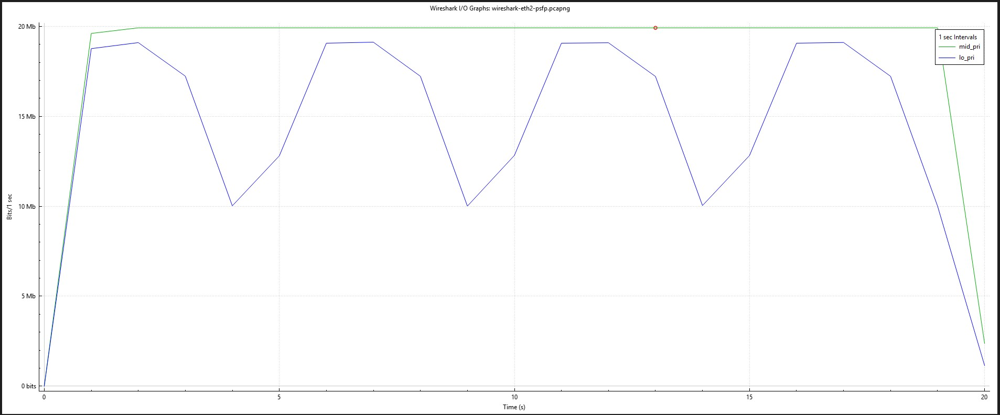
*Graph (1sec interval) showing stream_lo (blue) clipped at the top of each sine cycle and stream_mid (green) is essentially flat *

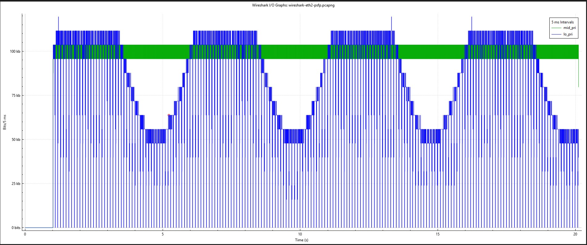
*Graph (5msec interval) showing stream_lo (blue) gated transmission*

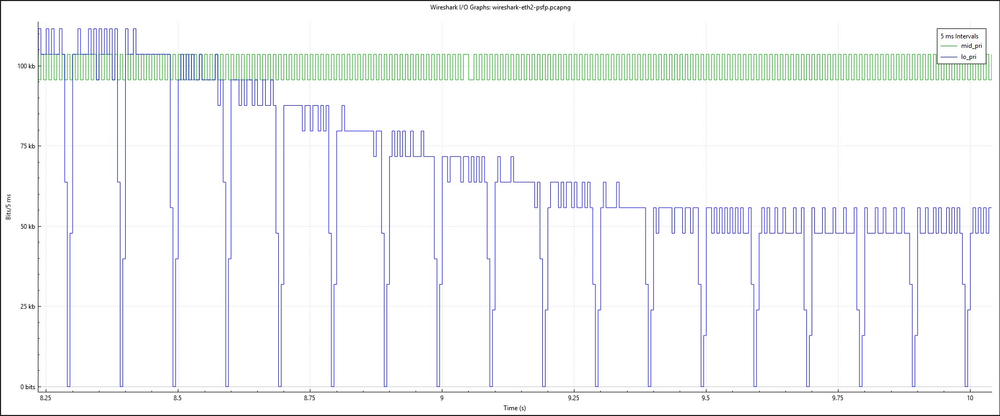
*Graph (5msec interval) showing stream_lo (blue) gates opened for 90ms and closed 10ms*

**stream_lo (UDP dport 20001, policed + gated Stream 2):**

- Received rate is clearly clipped at the top of each sine cycle: it plateaus at **~19.0–19.1 Mbps** during the ~2.5 s the generator is driving it above the 20 Mbps CIR (up to ~30 Mbps at the true peak), instead of following the sinusoid up to 30 Mbps.
- During the trough of each cycle (generator down near ~10 Mbps, i.e. already below CIR), the received rate tracks down to **~9.1–9.2 Mbps** , consistent with that traffic being all-green at the meter (nothing to police) but still losing the gate's ~10% closed-window share.
- This clip-at-top / track-at-bottom pattern repeats identically across all four observed sine periods (~5 s apart), so the effect is steady-state, not a startup transient.
- Overall average throughput for the flow across its active ~19.1 s window: **15.76 Mbps** , well below the generator's configured 20 Mbps mean, which is expected once every peak above CIR is clipped and every cycle loses its ~10 ms gate window.
- Inter-packet-gap analysis found **191 gaps of ~10.0–11.2 ms** (mean ≈10.5 ms) in the stream , matching almost exactly the 191 gate cycles expected for a 19.1 s active window at the configured `cycle-time 100 ms`. This is direct on-the-wire confirmation that Stream Gate 1's 90 ms-open/10 ms-closed schedule is being enforced, independent of the flow meter.

**stream_mid (UDP dport 30001, unclassified traffic):**

- Received rate is essentially flat at **19.92 Mbps** for the entire capture, matching the generator's configured 20 Mbps CBR (the small delta is normal framing/IFG overhead) with no visible dips, drops, or interaction with `stream_lo`'s excess traffic or the PSFP actions applied to Stream 2.
