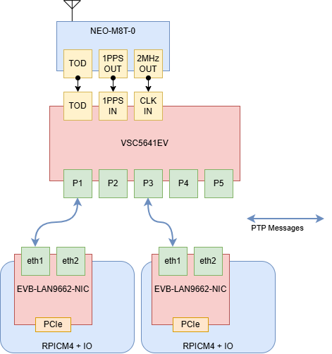

# TSN Precision Time Protocol (802.1AS/gPTP)

## 1 Objective

Verify end-to-end IEEE 802.1AS generalized Precision Time Protocol (gPTP) synchronization from a GNSS-referenced VSC5641EV TSN switch to the hardware clocks and Linux system clocks of the LAN9662/Raspberry Pi end points.

The demo confirms that:

- The VSC5641EV accepts the GNSS time reference through RMC time-of-day (ToD), 1PPS, and the configured 2.048 MHz frequency input.
- PTP instance 0 operates as a two-step, Layer-2, peer-delay boundary clock using the 802.1AS profile.
- Each connected end point uses hardware timestamping and reaches the locked `s2` servo state in `ptp4l`.
- `phc2sys` transfers time from the synchronized PTP Hardware Clock (PHC) to `CLOCK_REALTIME` and reaches a stable sub-microsecond offset.
- The synchronized time base is suitable for the related TSN demos, subject to the scope and limitations stated below.

This is a functional synchronization demo.

## 2 Why 802.1AS Matters to the Other TSN Demos

| Demo | Relationship to gPTP |
| --- | --- |
| [TSN Time-Aware Shaping (TAS)](tsn-time-aware-shaping-(tas)-demo.md) | A common time base is required to align gate-control-list phases across time-aware devices and to interpret captures against the intended schedule. A single switch can continue cycling a local schedule while free-running, but that does not demonstrate network-wide time alignment. |
| [TSN Per-Stream Filtering and Policing (PSFP)](tsn-per-stream-filtering-and-policing-(psfp)-demo.md) | Token-bucket policing does not require absolute time. The demo's 90 ms open / 10 ms closed stream gate is time-driven, however, so gPTP is needed when its phase must align with talkers, listeners, or gates on other devices. |
| [TSN Credit-Based Shaper (CBS)](tsn-credit-based-haper-(cbs)-demo.md) | CBS credit accounting does not require a shared wall clock. gPTP is still useful for synchronized traffic-generator start/stop, comparable timestamps, and correlating captures from multiple end points. |

The time flow in this setup is:

`GNSS receiver -> switch virtual PTP port -> switch local clock -> 802.1AS over Ethernet -> end-point PHC -> Linux CLOCK_REALTIME`

## 3 Test Topology



- **GNSS reference - u-blox NEO-M8T-0**
    - RMC ToD is connected to the switch serial ToD input.
    - 1PPS is connected to the switch 1PPS input.
    - The frequency output must be programmed to match the switch's configured `2048khz` input. The diagram's "2MHz" label is shorthand; verify the actual output frequency before the test.
- **TSN switch - VSC5641EV**
    - PTP instance 0 is a two-step 802.1AS boundary clock.
    - Its virtual port is disciplined by GNSS, and its Ethernet ports distribute time using Layer-2 gPTP and peer-delay measurement.
    - In the diagram, P1 connects to EP1 `eth1` and P3 connects to EP2 `eth1`. P2 and P4 are also PTP-enabled in the captured configuration because they are used by the related TSN demos.
- **End Point 1 and End Point 2 - Raspberry Pi CM4 + EVB-LAN9662-NIC**
    - `eth1` is the gPTP-facing interface in the recorded commands.
    - `/dev/ptp1` is the expected PHC device, but this mapping must be checked on each end point rather than assumed.

gPTP is transported directly in Ethernet frames (`EtherType 0x88F7`) and is link-local. It is not IP/UDP PTP, and routers do not forward these messages.

## 4 Prerequisites and Pre-Test Checks

Before starting the servo processes:

1. Confirm that the GNSS antenna has a valid fix and that RMC, 1PPS, and the frequency reference are present at the switch inputs.
2. Confirm that the switch frequency input and GNSS frequency output both use 2.048 MHz.
3. Install LinuxPTP on both end points and confirm that `ptp4l` and `phc2sys` are available.
4. Confirm that the end-point NIC supports hardware transmit/receive timestamping and a PHC:

    ```console
    $ command -v ptp4l
    $ command -v phc2sys
    $ ethtool -T eth1
    ```

    `ethtool` should report hardware transmit and receive timestamping and identify the PTP Hardware Clock index. For example, `PTP Hardware Clock: 1` corresponds to `/dev/ptp1`.

5. Confirm that no other `ptp4l` or `phc2sys` instance is controlling the same clocks:

    ```console
    $ pgrep -a ptp4l
    $ pgrep -a phc2sys
    ```

6. Stop or isolate any other service that is stepping or slewing `CLOCK_REALTIME` during the test, such as another PTP or NTP client. Two clock-control loops acting on the same clock invalidate the result.
7. Confirm that `/etc/linuxptp/configs/gPTP.cfg` exists. Its effective settings must agree with the switch: Layer-2 transport, peer-to-peer delay, hardware timestamping, and 802.1AS transport-specific value `1`.

## 5 End-Point Configuration

Perform the following on **each** end point, substituting the actual interface and PHC device found during the pre-test check.

### 5.1 Synchronize the PHC with `ptp4l`

Run `ptp4l` in the foreground during setup so that state transitions and errors remain visible:

```console
$ sudo ptp4l \
  -i eth1 \
  -p /dev/ptp1 \
  -f /etc/linuxptp/configs/gPTP.cfg \
  -m
```

The expected state progression is broadly `INITIALIZING -> LISTENING -> UNCALIBRATED -> SLAVE`. In the periodic servo output:

- `s0` means the servo is unlocked.
- `s1` means a clock step is being performed.
- `s2` means the servo is locked and is correcting the clock by frequency adjustment.

Do not start judging offsets during `s0` or `s1`. Wait for stable `s2` output.

### 5.2 Synchronize Linux system time with `phc2sys`

Once `ptp4l` is running, open another terminal and run:

```console
$ sudo phc2sys \
  -s /dev/ptp1 \
  -c CLOCK_REALTIME \
  --step_threshold=1 \
  --transportSpecific=1 \
  -w \
  -m
```

`ptp4l` controls the NIC PHC from the gPTP network. `phc2sys` then uses that PHC as its source (`-s`) and controls the Linux system clock (`-c CLOCK_REALTIME`). `-w` waits for `ptp4l` to publish a usable time relationship, while `--transportSpecific=1` selects the 802.1AS transport-specific value.

After foreground validation, the same processes may be launched under the system's service manager. If they are temporarily backgrounded with `&`, redirect their output to a known log file so evidence is not lost.

## 6 TSN Switch Configuration (VSC5641EV)

The significant settings are:

- `boundary twostep ethernet twoway ... profile 802.1as`: boundary-clock operation, two-step Sync/Follow_Up, Layer-2 transport, peer-delay, and the 802.1AS profile.
- `sync-interval -3`: one Sync every `2^-3` seconds, or 125 ms (8 Sync messages/s).
- `announce interval 0`: one Announce message per second; `timeout 3` declares a timeout after three announce intervals.
- `delay-mechanism p2p`: peer-delay measurement, required for this gPTP setup.
- `mcast-dest link-local`: use the link-local PTP multicast destination.
- `virtual-port mode pps-in 2` plus `tod ser proto rmc`: discipline the switch clock from the external 1PPS and RMC ToD source.
- `force-as-capable path-delay 0`: force the port to be treated as 802.1AS-capable. This is convenient for a controlled demo but bypasses an important qualification check; it must not be used as evidence of standards conformance.

Apply the PTP portion of the following captured running configuration. Baseline management, spanning-tree, voice-VLAN, and user-account lines are not required for the gPTP function and should be preserved according to the lab's normal switch configuration rather than copied from another unit.

Log-in as Admin to PCB135 using **`ICLI`**, then configure the following:

!!! Recommended

	Clear all switch configuration back to default but keep the switch's IP address
	```console
	# reload defaults keep-ip force
	```

```console
# configure terminal
```

```console
(config)# network-clock output-source 2048khz
(config)# network-clock ssm-holdover prc
(config)# network-clock ssm-freerun prc
(config)# network-clock clk-source 3 nominate clk-in
(config)# network-clock clk-source 3 aneg-mode master
(config)# network-clock clk-source 3 ssm-overwrite prc
(config)# network-clock input-source 2048khz
(config)# network-clock selector manual clk-source 3
(config)# ptp 0 mode boundary twostep ethernet twoway vid 1 0 profile 802.1as mep 1
(config)# ptp 0 filter-type basic
(config)# ptp 0 source-time-inaccuracy 0
(config)# ptp 0 gm-time-inaccuracy 0
(config)# ptp 0 dist-time-inaccuracy 0
(config)# ptp 0 virtual-port mode pps-in 2 pps-delay 5
(config)# ptp 0 virtual-port tod ser proto rmc
(config)# ptp rs422 baudrate 9600 parity none wordlength 8 stopbits 1 flowctrl none

(config)# interface GigabitEthernet 1/1
(config-if)# network-clock synchronization ssm
(config-if)#  ptp 0 
(config-if)#  ptp 0 announce interval 0 timeout 3
(config-if)#  ptp 0 sync-interval -3
(config-if)#  ptp 0 delay-mechanism p2p
(config-if)#  ptp 0 delay-req interval 0
(config-if)#  ptp 0 delay-asymmetry 0
(config-if)#  ptp 0 ingress-latency 0
(config-if)#  ptp 0 egress-latency 0
(config-if)#  ptp 0 mcast-dest link-local
(config-if)#  ptp 0 mgtSettableLogSyncInterval -3
(config-if)#  ptp 0 mgtSettableLogAnnounceInterval 0
(config-if)#  ptp 0 mgtSettableLogPdelayReqInterval 0
(config-if)#  ptp 0 mgtSettableLogGptpCapableMessageInterval 0
(config-if)#  ptp 0 usemgtSettableLogSyncInterval 1
(config-if)#  ptp 0 usemgtSettableLogAnnounceInterval 1
(config-if)#  ptp 0 usemgtSettableLogPdelayReqInterval 1
(config-if)#  ptp 0 useMgtSettableLogGptpCapableMessageInterval 1
(config-if)#  ptp 0 gptp-interval 0
(config-if)#  ptp 0 force-as-capable path-delay 1 
(config-if)# exit

(config)# interface GigabitEthernet 1/2
(config-if)# network-clock synchronization ssm
(config-if)# ptp 0 
(config-if)# ptp 0 announce interval 0 timeout 3
(config-if)# ptp 0 sync-interval -3
(config-if)# ptp 0 delay-mechanism p2p
(config-if)# ptp 0 delay-req interval 0
(config-if)# ptp 0 delay-asymmetry 0
(config-if)# ptp 0 ingress-latency 0
(config-if)# ptp 0 egress-latency 0
(config-if)# ptp 0 mcast-dest link-local
(config-if)# ptp 0 mgtSettableLogSyncInterval -3
(config-if)# ptp 0 mgtSettableLogAnnounceInterval 0
(config-if)# ptp 0 mgtSettableLogPdelayReqInterval 0
(config-if)# ptp 0 mgtSettableLogGptpCapableMessageInterval 0
(config-if)# ptp 0 usemgtSettableLogSyncInterval 1
(config-if)# ptp 0 usemgtSettableLogAnnounceInterval 1
(config-if)# ptp 0 usemgtSettableLogPdelayReqInterval 1
(config-if)# ptp 0 useMgtSettableLogGptpCapableMessageInterval 1
(config-if)# ptp 0 gptp-interval 0
(config-if)# ptp 0 force-as-capable path-delay 1 
(config-if)# exit

(config)# interface GigabitEthernet 1/3
(config-if)# network-clock synchronization ssm
(config-if)# ptp 0 
(config-if)# ptp 0 announce interval 0 timeout 3
(config-if)# ptp 0 sync-interval -3
(config-if)# ptp 0 delay-mechanism p2p
(config-if)# ptp 0 delay-req interval 0
(config-if)# ptp 0 delay-asymmetry 0
(config-if)# ptp 0 ingress-latency 0
(config-if)# ptp 0 egress-latency 0
(config-if)# ptp 0 mcast-dest link-local
(config-if)# ptp 0 mgtSettableLogSyncInterval -3
(config-if)# ptp 0 mgtSettableLogAnnounceInterval 0
(config-if)# ptp 0 mgtSettableLogPdelayReqInterval 0
(config-if)# ptp 0 mgtSettableLogGptpCapableMessageInterval 0
(config-if)# ptp 0 usemgtSettableLogSyncInterval 1
(config-if)# ptp 0 usemgtSettableLogAnnounceInterval 1
(config-if)# ptp 0 usemgtSettableLogPdelayReqInterval 1
(config-if)# ptp 0 useMgtSettableLogGptpCapableMessageInterval 1
(config-if)# ptp 0 gptp-interval 0
(config-if)# ptp 0 force-as-capable path-delay 1 
(config-if)# exit

(config)# interface GigabitEthernet 1/4
(config-if)# network-clock synchronization ssm
(config-if)# ptp 0 
(config-if)# ptp 0 announce interval 0 timeout 3
(config-if)# ptp 0 sync-interval -3
(config-if)# ptp 0 delay-mechanism p2p
(config-if)# ptp 0 delay-req interval 0
(config-if)# ptp 0 delay-asymmetry 0
(config-if)# ptp 0 ingress-latency 0
(config-if)# ptp 0 egress-latency 0
(config-if)# ptp 0 mcast-dest link-local
(config-if)# ptp 0 mgtSettableLogSyncInterval -3
(config-if)# ptp 0 mgtSettableLogAnnounceInterval 0
(config-if)# ptp 0 mgtSettableLogPdelayReqInterval 0
(config-if)# ptp 0 mgtSettableLogGptpCapableMessageInterval 0
(config-if)# ptp 0 usemgtSettableLogSyncInterval 1
(config-if)# ptp 0 usemgtSettableLogAnnounceInterval 1
(config-if)# ptp 0 usemgtSettableLogPdelayReqInterval 1
(config-if)# ptp 0 useMgtSettableLogGptpCapableMessageInterval 1
(config-if)# ptp 0 gptp-interval 0
(config-if)# ptp 0 force-as-capable path-delay 1 
(config-if)# exit
(config)# exit
```

## 7 Switch Verification

After applying the configuration, verify the time source, local clock, parent relationship, and physical-port states:

```console
# show ptp 0 virtual-port
# show ptp 0 local-clock
# show ptp 0 slave
# show ptp 0 parent
# show ptp 0 current
# show ptp 0 port-state
```

The exact column names depend on the switch build, but verify all of the following:

- The virtual port is enabled and locked to the external time reference rather than free-running.
- The local clock shows the correct current time.
- The GNSS-fed virtual port is the switch clock's active timing source.
- Each connected Ethernet port is enabled for PTP and reaches the expected master role toward its end point.
- There are no repeating announce, Sync, or peer-delay timeouts.

Save this command output with the end-point logs. The running configuration proves what was requested; operational status proves what the switch actually selected and locked to.

## 8 Test Procedure

1. Power and connect the GNSS receiver, switch, and both end points as shown in the topology.
2. Wait for the GNSS receiver to obtain a valid fix and for the switch virtual port/local clock to lock.
3. Apply the switch configuration and verify its operational state with the commands above.
4. On EP1, start `ptp4l`, wait for stable `s2`, and then start `phc2sys`.
5. Repeat the same sequence on EP2.
6. Let both systems run for at least 60 seconds after lock. Capture the complete `ptp4l` and `phc2sys` output from each end point.
7. During the observation window, check for state changes, timeouts, large offset excursions, or repeated clock steps.
8. Record a short packet capture if message sequencing or peer-delay behavior needs to be diagnosed.
9. Only after both end points have passed should the synchronized start function in the CBS/TAS demonstrations or time-based PSFP/TAS analysis be treated as valid.

## 9 Expected Behavior

The thresholds below are practical acceptance criteria for this lab demonstration, not normative IEEE 802.1AS conformance limits.

| Check                 | Pass criterion                                                                                                        |
| --------------------- | --------------------------------------------------------------------------------------------------------------------- |
| GNSS reference        | Valid ToD and 1PPS; switch virtual port locked; switch local time is correct.                                         |
| Switch Ethernet ports | Connected gPTP ports remain operational in the expected PTP role with no recurring timeout or fault.                  |
| PHC offset stability  | Periodic `ptp4l` summaries remain within 100 ns RMS and 200 ns maximum during the 60-second observation window.       |
| Linux system clock    | `phc2sys` remains in `s2` and the absolute `CLOCK_REALTIME`-to-PHC offset remains below 1 microsecond after settling. |
| Repeatability         | Both EP1 and EP2 independently meet the same criteria without a servo restart.                                        |

## 10 Results

### 10.1 Captured Log

The available record contains the following approximately four-second settled excerpt. The log does not identify which end point produced it, so it is treated as evidence for one captured end point only.

```{ .text .no-copy }
[2026-09-10 15:59:23.247] [phc2sys] phc2sys[29543.402]: CLOCK_REALTIME phc offset        11 s2 freq   +6435 delay   5629
[2026-09-10 15:59:23.319] [ptp4l] ptp4l[29543.473]: X,61377,1789027163,313400864,1789027163,313400574,-0000000000,000
[2026-09-10 15:59:23.453] [ptp4l] ptp4l[29543.606]: X,61378,1789027163,446162878,1789027163,446162590,-0000000000,000
[2026-09-10 15:59:23.585] [ptp4l] ptp4l[29543.739]: X,61379,1789027163,578916720,1789027163,578916431,-0000000000,000
[2026-09-10 15:59:23.717] [ptp4l] ptp4l[29543.871]: X,61380,1789027163,710658063,1789027163,710657775,-0000000000,000
[2026-09-10 15:59:23.849] [ptp4l] ptp4l[29544.003]: X,61381,1789027163,843401279,1789027163,843400990,-0000000000,000
[2026-09-10 15:59:23.982] [ptp4l] ptp4l[29544.136]: X,61382,1789027163,976103711,1789027163,976103421,-0000000000,000
[2026-09-10 15:59:23.986] [ptp4l] ptp4l[29544.136]: rms    4 max    6 freq +13068 +/-   1 delay  -285 +/-   0
[2026-09-10 15:59:24.116] [ptp4l] ptp4l[29544.269]: X,61383,1789027164,108876966,1789027164,108876677,-0000000000,000
[2026-09-10 15:59:24.247] [phc2sys] phc2sys[29544.402]: CLOCK_REALTIME phc offset         2 s2 freq   +6430 delay   5629
[2026-09-10 15:59:24.248] [ptp4l] ptp4l[29544.401]: X,61384,1789027164,241621512,1789027164,241621221,-0000000000,000
[2026-09-10 15:59:24.381] [ptp4l] ptp4l[29544.534]: X,61385,1789027164,373352840,1789027164,373352549,-0000000000,000
[2026-09-10 15:59:24.513] [ptp4l] ptp4l[29544.666]: X,61386,1789027164,506113423,1789027164,506113132,-0000000000,000
[2026-09-10 15:59:24.646] [ptp4l] ptp4l[29544.798]: X,61387,1789027164,638806455,1789027164,638806163,-0000000000,000
[2026-09-10 15:59:24.779] [ptp4l] ptp4l[29544.932]: X,61388,1789027164,771585639,1789027164,771585347,-0000000000,000
[2026-09-10 15:59:24.912] [ptp4l] ptp4l[29545.064]: X,61389,1789027164,904308206,1789027164,904307914,-0000000000,000
[2026-09-10 15:59:25.044] [ptp4l] ptp4l[29545.196]: X,61390,1789027165,036074998,1789027165,036074705,-0000000000,000
[2026-09-10 15:59:25.049] [ptp4l] ptp4l[29545.196]: rms    6 max    8 freq +13059 +/-   3 delay  -285 +/-   0
[2026-09-10 15:59:25.177] [ptp4l] ptp4l[29545.329]: X,61391,1789027165,168816062,1789027165,168815769,-0000000000,000
[2026-09-10 15:59:25.249] [phc2sys] phc2sys[29545.402]: CLOCK_REALTIME phc offset         9 s2 freq   +6437 delay   6074
[2026-09-10 15:59:25.309] [ptp4l] ptp4l[29545.462]: X,61392,1789027165,301505717,1789027165,301505424,-0000000000,000
[2026-09-10 15:59:25.440] [ptp4l] ptp4l[29545.594]: X,61393,1789027165,434290525,1789027165,434290232,-0000000000,000
[2026-09-10 15:59:25.573] [ptp4l] ptp4l[29545.727]: X,61394,1789027165,567031589,1789027165,567031295,-0000000000,000
[2026-09-10 15:59:25.705] [ptp4l] ptp4l[29545.859]: X,61395,1789027165,698773548,1789027165,698773255,-0000000000,000
[2026-09-10 15:59:25.838] [ptp4l] ptp4l[29545.992]: X,61396,1789027165,831500100,1789027165,831499806,-0000000000,000
[2026-09-10 15:59:25.970] [ptp4l] ptp4l[29546.124]: X,61397,1789027165,964208462,1789027165,964208166,-0000000000,000
[2026-09-10 15:59:26.103] [ptp4l] ptp4l[29546.257]: X,61398,1789027166,096987851,1789027166,096987559,-0000000000,000
[2026-09-10 15:59:26.106] [ptp4l] ptp4l[29546.257]: rms    9 max   11 freq +13049 +/-   3 delay  -285 +/-   0
[2026-09-10 15:59:26.236] [ptp4l] ptp4l[29546.390]: X,61399,1789027166,229673421,1789027166,229673127,-0000000000,000
[2026-09-10 15:59:26.248] [phc2sys] phc2sys[29546.403]: CLOCK_REALTIME phc offset       -31 s2 freq   +6400 delay   5592
[2026-09-10 15:59:26.367] [ptp4l] ptp4l[29546.521]: X,61400,1789027166,361462291,1789027166,361461999,-0000000000,000
[2026-09-10 15:59:26.499] [ptp4l] ptp4l[29546.654]: X,61401,1789027166,494223589,1789027166,494223295,-0000000000,000
[2026-09-10 15:59:26.633] [ptp4l] ptp4l[29546.787]: X,61402,1789027166,626914475,1789027166,626914184,-0000000000,000
[2026-09-10 15:59:26.765] [ptp4l] ptp4l[29546.920]: X,61403,1789027166,759691822,1789027166,759691529,-0000000000,000
[2026-09-10 15:59:26.898] [ptp4l] ptp4l[29547.052]: X,61404,1789027166,892425020,1789027166,892424731,-0000000000,000
[2026-09-10 15:59:27.030] [ptp4l] ptp4l[29547.184]: X,61405,1789027167,024159622,1789027167,024159332,-0000000000,000
[2026-09-10 15:59:27.162] [ptp4l] ptp4l[29547.317]: X,61406,1789027167,156934308,1789027167,156934021,-0000000000,000
[2026-09-10 15:59:27.166] [ptp4l] ptp4l[29547.317]: rms    7 max    9 freq +13043 +/-   2 delay  -285 +/-   0
[2026-09-10 15:59:27.248] [phc2sys] phc2sys[29547.403]: CLOCK_REALTIME phc offset         3 s2 freq   +6425 delay   5592
[2026-09-10 15:59:27.296] [ptp4l] ptp4l[29547.450]: X,61407,1789027167,289604550,1789027167,289604260,-0000000000,000

```

| Metric                           |                                            Observed in the excerpt | Assessment                                                                                             |
| -------------------------------- | -----------------------------------------------------------------: | ------------------------------------------------------------------------------------------------------ |
| `ptp4l` servo                    | Settled summary output; raw records continue without a state reset | Functional lock is indicated, although the excerpt does not include the earlier state-transition line. |
| `ptp4l` RMS offset               |                                     4, 6, 9, and 7 ns; mean 6.5 ns | Passes the demo threshold in this short window.                                                        |
| `ptp4l` maximum offset           |                               6, 8, 11, and 9 ns; worst case 11 ns | Passes the demo threshold in this short window.                                                        |
| `ptp4l` frequency correction     |                                             +13,068 to +13,043 ppb | Stable over the excerpt; correction moved by only 25 ppb.                                              |
| `phc2sys` state                  |                                   `s2` on all five visible samples | Pass.                                                                                                  |
| `CLOCK_REALTIME` offset from PHC |            +11, +2, +9, -31, and +3 ns; worst absolute value 31 ns | Passes the demo threshold in this short window.                                                        |


The captured end point therefore demonstrates nanosecond-level steady-state servo performance during the recorded interval: `ptp4l` had 6.5 ns mean RMS across its four summaries, an 11 ns worst reported maximum, and `phc2sys` stayed within 31 ns of the PHC. These numbers are substantially inside the demo thresholds.
