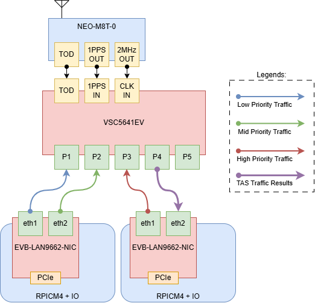
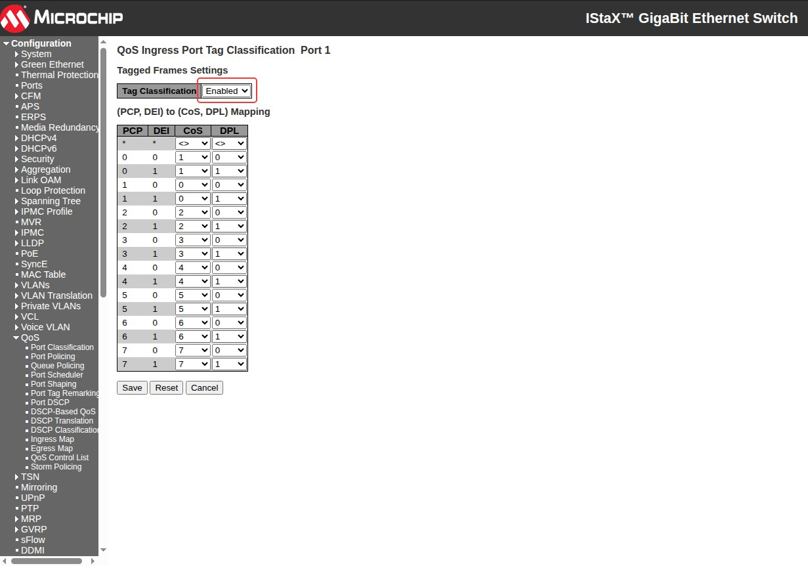
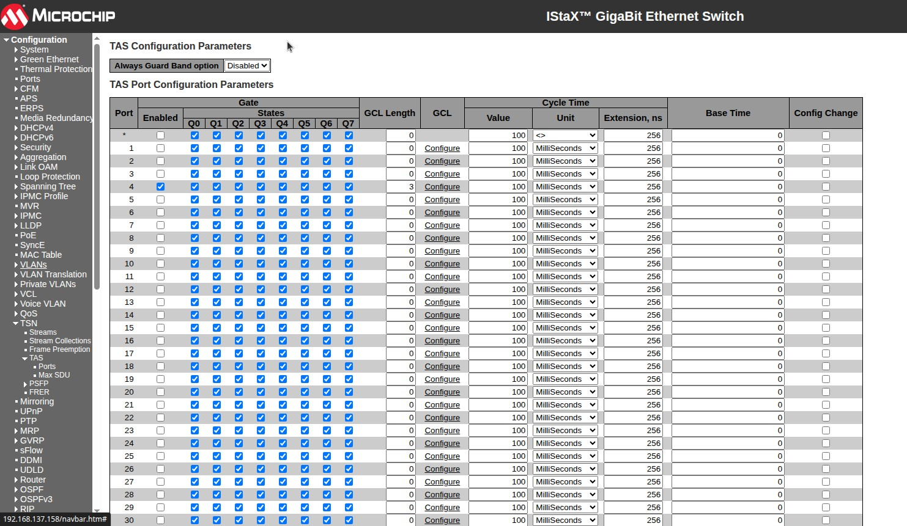
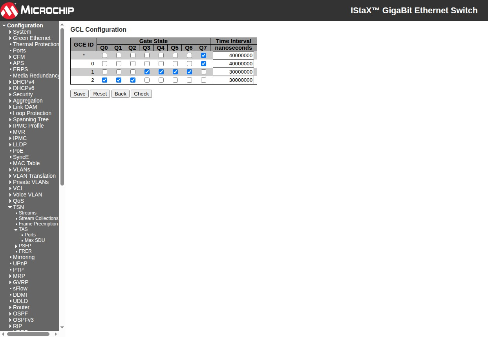
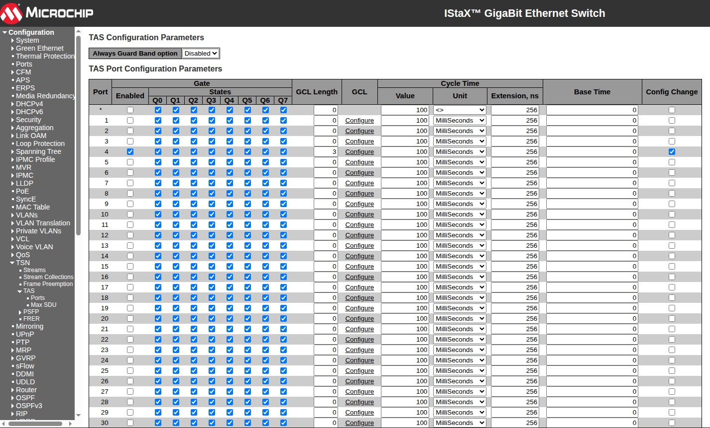
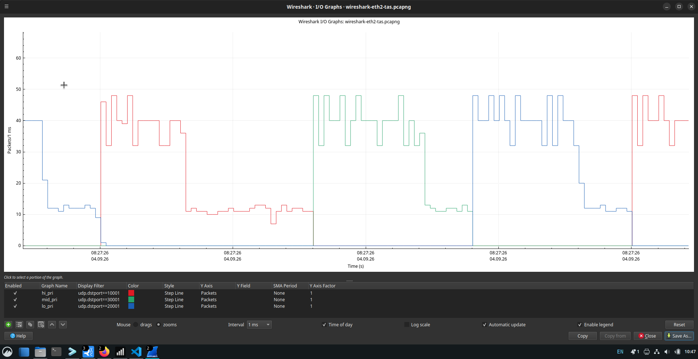
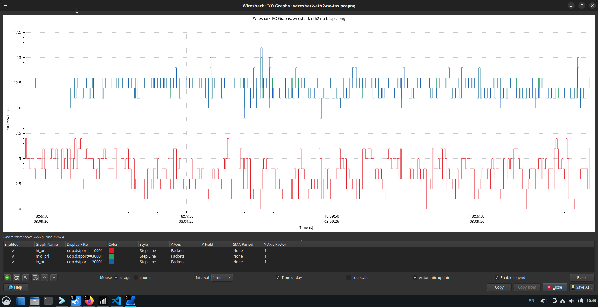

# TSN Time-Aware Shaping (TAS)

## 1 Objective

Verify that IEEE 802.1Qbv Time-Aware Shaping (TAS) on the TSN switch correctly isolates high-priority, medium-priority, and low-priority traffic into separate, non-overlapping gate windows, and that no priority class leaks into another class's window.

## 2 Test Topology



- **End Point 2 RPi + LAN9662 (EP2)**
    - Port 1: transmits high-priority stream (PCP 7)
    - Port 2: receives merged/shaped traffic; Wireshark capture point (diagram legend: purple "TAS Traffic Results" edge)
- **End Point 1 RPi + LAN9662 (EP1)**
    - Port 1: transmits low-priority stream (PCP 0)
    - Port 2: transmits medium-priority stream (PCP 5)
- **TSN Switch (VSC5641EV)**
    - All three talker streams (low, medium, high) ingress on three separate switch ports (Gi1/1–Gi1/3) and egress toward EP2 Port 2 through a single shaped port
    - Egress port (Gi1/4) configured with TAS (802.1Qbv); this is the only port with `tsn tas gate-enabled`
    - NOTE: the exact Gi1/1–Gi1/3 to low/medium/high stream assignment is not recorded in this document; only the shared egress port (Gi1/4) is functionally relevant to the gate schedule under test
- **PTP**: all devices synchronized using the procedure and pass criteria in [TSN Precision Time Protocol (802.1AS/gPTP)](tsn-ptp-(802.1as)-demo.md) (gPTP / IEEE 802.1AS, sync interval 2^-3 = 125 ms per `ptp 0 sync-interval -3`; see the switch configuration below for exact intervals)
- **Capture point**: Wireshark on EP2 Port 2, downstream of the TAS-shaped egress port


## 3 Traffic Generator Configuration

Use the `tsn-traffic-gen` application described in [Generating a Traffic Stream](tsn-traffic-generator.md) to load and run the following configurations. Start the generator on both end points only after the ports, templates, and streams have been reviewed in the TUI.

The UDP destination port is used as the Wireshark filter to distinguish each captured priority class: `10001` for high, `20001` for low, and `30001` for medium. The corresponding UDP source ports are `10000`, `20000`, and `30000`.

All three streams are sent to the same destination MAC address, which is the MAC address of the end point (EP2 Port 2) where the TAS result is captured and analyzed.

### 3.1 EP1 Low and Medium Priority Talkers

Save the following configuration as `tsn-demo-config.ini` on EP1:

```ini
[global]
latency_max_ns=200000
measure_ooo=true
stats_samples=100
test_id=42
sync_port=45900
sync_lead_ms=150

[port]
name=tx
interface=eth1
disabled=false

[port]
name=tx0
interface=eth2
disabled=false

[template]
name=lo_pri
port=tx
header_stack=mac,vlan,ip,udp
vlan_enabled=true
vlan_id=1
vlan_pcp=0
ip_dscp=0
ip_ttl=64
udp_src_port=20000
udp_dst_port=20001
data_fill=random

[template]
name=mid_pri
port=tx0
header_stack=mac,vlan,ip,udp
vlan_enabled=true
vlan_id=1
vlan_pcp=5
ip_dscp=0
ip_ttl=64
udp_src_port=30000
udp_dst_port=30001
data_fill=random

[stream]
name=stream_lo
id=2
port=tx
tx_template=lo_pri
mbps=900
pps=0
packet_size=1000
packet_count=0
disabled=false

[stream]
name=stream_mid
id=3
port=tx0
tx_template=mid_pri
mbps=900
pps=0
packet_size=1000
packet_count=0
disabled=false
```

Load it from the `tsn-traffic-gen` repository root:

```bash
sudo ./tsn-traffic-gen -c tsn-demo-config.ini
```

### 3.2 EP2 High Priority Talker

Save the following configuration as `tas-demo-config.ini` on EP2:

```ini
[global]
latency_max_ns=200000
measure_ooo=true
stats_samples=100
test_id=42
sync_port=45900
sync_lead_ms=150

[port]
name=tx
interface=eth1
disabled=false

[port]
name=tx0
interface=eth2
disabled=false

[template]
name=hi_pri
port=tx
header_stack=mac,vlan,ip,udp
vlan_enabled=true
vlan_id=1
vlan_pcp=7
ip_dscp=0
ip_ttl=64
udp_src_port=10000
udp_dst_port=10001
data_fill=random

[stream]
name=stream_hi
id=1
port=tx
tx_template=hi_pri
mbps=900
pps=0
packet_size=1000
packet_count=0
disabled=false
```

Load it from the `tsn-traffic-gen` repository root:

```bash
sudo ./tsn-traffic-gen -c tas-demo-config.ini
```

### 3.3 Synchronized Start and Stop

Both generator instances use the same `test_id`, `sync_port`, and `sync_lead_ms`, allowing EP1 to control a synchronized test:

1. Synchronize the system clocks on EP1 and EP2 as described in [TSN Precision Time Protocol (802.1AS/gPTP)](tsn-ptp-(802.1as)-demo.md), and confirm that UDP broadcast traffic on port `45900` can pass between them.
2. Load both configurations and leave both TUIs running.
3. Start the Wireshark capture on EP2 Port 2.
4. On EP1, press uppercase `S` or select **Sync** to enable the Sync latch.
5. On EP1, press lowercase `s` or select **Start**. EP1 broadcasts the command through its first configured port (`eth1`), and both instances schedule transmission for the same target time, 150 ms later.
6. When the capture interval is complete, leave the Sync latch enabled and press `s` or select **Stop** on EP1 to schedule a synchronized stop on both instances.

### 3.4 How the Talker Configuration Fits the Test
EP1 is a single traffic generator running two streams at once: `stream_lo` out its `tx` port (`eth1`, VLAN PCP 0, UDP destination port 20001) and `stream_mid` out its `tx0` port (`eth2`, VLAN PCP 5, UDP destination port 30001). EP2 is a second traffic generator running one stream, `stream_hi`, out its `tx` port (`eth1`, VLAN PCP 7, UDP destination port 10001). All three streams are generated at 900 Mbps with 1000-byte packets, so each is individually capable of saturating a gigabit link. This makes the TAS gating visible: without a schedule, three simultaneous 900 Mbps streams would contend for the same 1 Gbps egress port.

Each of the three talker ports (EP1's two ports, EP2's one port) connects to a separate switch ingress port, Gi1/1–Gi1/3. With `qos trust tag` configured on those ports (§4.2), the switch classifies each stream directly from its VLAN PCP into the matching queue PCP 0 → queue 0 (low), PCP 5 → queue 5 (mid), PCP 7 → queue 7 (high) with no dependency on the UDP ports used in the streams themselves. All three queues converge on the shared egress port, Gi1/4, which is the only port with `tsn tas gate-enabled` and the 40 ms/30 ms/30 ms gate schedule (§4.3). That convergence point is also where both Wireshark captures (`wireshark-eth2.csv`, `wireshark-eth2-no-tas.csv`) are taken, and where the UDP destination port is used purely as a post-capture filter to sort packets back into their priority class.

## 4 TSN Switch Configuration (VSC5641EV)

### 4.1 PTP Requirement

Complete [TSN Precision Time Protocol (802.1AS/gPTP)](tsn-ptp-(802.1as)-demo.md) before enabling or evaluating the TAS schedule. At minimum, the switch must be locked to its GNSS-backed time source and the end point connected to the egress/capture port must be synchronized to the switch. Synchronizing both generator hosts is also required when using the traffic generator's coordinated start function.

A repeating gate-control list can appear to operate while the switch is free-running, but that only demonstrates local cycling. It does not prove that the gate phase is aligned to other time-aware devices. Record the switch PTP state and stable endpoint `s2` state with the TAS evidence.

### 4.2 QoS Requirement

Apply Tag Classification

In the web, navigate to QoS → Port Classification and configure the following:





Applied identically to all three talker-facing ingress ports, this uses the default PCP-to-queue mapping (PCP *n* → queue *n*) so that each stream is classified into the queue matching its tagged PCP (low → queue 0, medium → queue 5, high → queue 7).

**Why this is mandatory for TAS**: `qos trust tag` sets the port's `trust_tag` field (`vtss_appl/include/vtss/appl/qos.h`), which is `FALSE` by default (`qos.cxx`). It flows into the MESA `tag.class_enable` bit and ultimately the chip's `PCP_DEI_QOS_ENA` register bit (`vtss_fa_qos.c`). When that bit is off, the ingress classifier ignores the frame's PCP entirely and puts *every* frame on the port into a single default queue (`default_cos`, itself 0 by default) regardless of PCP. TAS gate-control-list entries key strictly on queue number (`tsn tas control-list index N gate-state queue <0-7>`) with no PCP awareness of their own, so without trust-tag all three streams would collapse into queue 0 and share one gate window, destroying the isolation under test.

### 4.3 Time Aware Shaper (TAS) Configuration

#### 4.3.1 Configuration Steps

To create and start a Time Aware Shaper schedule on port 4 where the schedule contains three gate control entries:
- 0: Open queue 7 and close all other queues for 40 milliseconds
- 1: Open queue 3-6 and close all other queues for 30 milliseconds
- 2: Open queue 0-2 and close all other queues for 30 milliseconds
The schedule is repeated every 100 milliseconds.

In the web, navigate to TSN → TAS → Ports and configure the following:



When the port configuration is saved, click on "configure" in the GCL column and configure the gate control list as follows:



Finally, when port 1 is configured, activate the configuration using the "Config Change" checkbox:



The commands below configure gPTP (802.1AS) on all four ports, trust the ingress tag on the three talker-facing ports (Gi1/1–Gi1/3), and program the 40 ms / 30 ms / 30 ms TAS gate schedule on the shared egress port (Gi1/4).

```console
# configure terminal

(config)# ! Disable always-guard-band globally (guard band only applied to preemptible queues)
(config)# no tsn tas always-guard-band

! Configure PTP instance 0 as an 802.1AS (gPTP) boundary clock
(config)# ptp 0 mode boundary twostep ethernet twoway vid 1 0 profile 802.1as mep 1
(config)# ptp 0 filter-type basic
(config)# ptp 0 source-time-inaccuracy 0
(config)# ptp 0 gm-time-inaccuracy 0
(config)# ptp 0 dist-time-inaccuracy 0

! Configure the GNSS-fed virtual port (1PPS + RMC ToD reference)
(config)# ptp 0 virtual-port mode pps-in 2 pps-delay 5
(config)# ptp 0 virtual-port tod ser proto rmc
(config)# ptp rs422 baudrate 9600 parity none wordlength 8 stopbits 1 flowctrl none

! --- Gi1/1: low-priority talker-facing ingress port ---
(config)# interface GigabitEthernet 1/1
(config-if)# qos trust tag
(config-if)# network-clock synchronization ssm
(config-if)# ptp 0
(config-if)# ptp 0 announce interval 0 timeout 3
(config-if)# ptp 0 sync-interval -3
(config-if)# ptp 0 delay-mechanism p2p
(config-if)# ptp 0 delay-req interval 0
(config-if)# ptp 0 delay-asymmetry 0
(config-if)# ptp 0 ingress-latency 0
(config-if)# ptp 0 egress-latency 0
(config-if)# ptp 0 mcast-dest link-local
(config-if)# ptp 0 mgtSettableLogSyncInterval -3
(config-if)# ptp 0 mgtSettableLogAnnounceInterval 0
(config-if)# ptp 0 mgtSettableLogPdelayReqInterval 0
(config-if)# ptp 0 mgtSettableLogGptpCapableMessageInterval 0
(config-if)# ptp 0 usemgtSettableLogSyncInterval 1
(config-if)# ptp 0 usemgtSettableLogAnnounceInterval 1
(config-if)# ptp 0 usemgtSettableLogPdelayReqInterval 1
(config-if)# ptp 0 useMgtSettableLogGptpCapableMessageInterval 1
(config-if)# ptp 0 gptp-interval 0
(config-if)# ptp 0 force-as-capable path-delay 0
(config-if)# exit

! --- Gi1/2: medium-priority talker-facing ingress port ---
(config)# interface GigabitEthernet 1/2
(config-if)# switchport hybrid egress-tag all
(config-if)# qos trust tag
(config-if)# network-clock synchronization ssm
(config-if)# ptp 0
(config-if)# ptp 0 announce interval 0 timeout 3
(config-if)# ptp 0 sync-interval -3
(config-if)# ptp 0 delay-mechanism p2p
(config-if)# ptp 0 delay-req interval 0
(config-if)# ptp 0 delay-asymmetry 0
(config-if)# ptp 0 ingress-latency 0
(config-if)# ptp 0 egress-latency 0
(config-if)# ptp 0 mcast-dest link-local
(config-if)# ptp 0 mgtSettableLogSyncInterval -3
(config-if)# ptp 0 mgtSettableLogAnnounceInterval 0
(config-if)# ptp 0 mgtSettableLogPdelayReqInterval 0
(config-if)# ptp 0 mgtSettableLogGptpCapableMessageInterval 0
(config-if)# ptp 0 usemgtSettableLogSyncInterval 1
(config-if)# ptp 0 usemgtSettableLogAnnounceInterval 1
(config-if)# ptp 0 usemgtSettableLogPdelayReqInterval 1
(config-if)# ptp 0 useMgtSettableLogGptpCapableMessageInterval 1
(config-if)# ptp 0 gptp-interval 0
(config-if)# ptp 0 force-as-capable path-delay 0
(config-if)# exit

! --- Gi1/3: high-priority talker-facing ingress port ---
(config)# interface GigabitEthernet 1/3
(config-if)# switchport hybrid egress-tag all
(config-if)# qos trust tag
(config-if)# network-clock synchronization ssm
(config-if)# ptp 0
(config-if)# ptp 0 announce interval 0 timeout 3
(config-if)# ptp 0 sync-interval -3
(config-if)# ptp 0 delay-mechanism p2p
(config-if)# ptp 0 delay-req interval 0
(config-if)# ptp 0 delay-asymmetry 0
(config-if)# ptp 0 ingress-latency 0
(config-if)# ptp 0 egress-latency 0
(config-if)# ptp 0 mcast-dest link-local
(config-if)# ptp 0 mgtSettableLogSyncInterval -3
(config-if)# ptp 0 mgtSettableLogAnnounceInterval 0
(config-if)# ptp 0 mgtSettableLogPdelayReqInterval 0
(config-if)# ptp 0 mgtSettableLogGptpCapableMessageInterval 0
(config-if)# ptp 0 usemgtSettableLogSyncInterval 1
(config-if)# ptp 0 usemgtSettableLogAnnounceInterval 1
(config-if)# ptp 0 usemgtSettableLogPdelayReqInterval 1
(config-if)# ptp 0 useMgtSettableLogGptpCapableMessageInterval 1
(config-if)# ptp 0 gptp-interval 0
(config-if)# ptp 0 force-as-capable path-delay 0
(config-if)# exit

! --- Gi1/4: shaped egress port. This is where TAS is actually applied ---
(config)# interface GigabitEthernet 1/4
(config-if)# switchport hybrid egress-tag all
(config-if)# qos trust tag
(config-if)# no spanning-tree
(config-if)# network-clock synchronization ssm
(config-if)# ptp 0
(config-if)# ptp 0 announce interval 0 timeout 3
(config-if)# ptp 0 sync-interval -3
(config-if)# ptp 0 delay-mechanism p2p
(config-if)# ptp 0 delay-req interval 0
(config-if)# ptp 0 delay-asymmetry 0
(config-if)# ptp 0 ingress-latency 0
(config-if)# ptp 0 egress-latency 0
(config-if)# ptp 0 mcast-dest link-local
(config-if)# ptp 0 mgtSettableLogSyncInterval -3
(config-if)# ptp 0 mgtSettableLogAnnounceInterval 0
(config-if)# ptp 0 mgtSettableLogPdelayReqInterval 0
(config-if)# ptp 0 mgtSettableLogGptpCapableMessageInterval 0
(config-if)# ptp 0 usemgtSettableLogSyncInterval 1
(config-if)# ptp 0 usemgtSettableLogAnnounceInterval 1
(config-if)# ptp 0 usemgtSettableLogPdelayReqInterval 1
(config-if)# ptp 0 useMgtSettableLogGptpCapableMessageInterval 1
(config-if)# ptp 0 gptp-interval 0
(config-if)# ptp 0 force-as-capable path-delay 0

! Guard-band sizing for the express (queue 7) and best-effort (queue 0) traffic classes
(config-if)# tsn tas max-sdu queue 0 1000
(config-if)# tsn tas max-sdu queue 7 1000

! Gate control list: high(40ms) -> medium(30ms) -> low(30ms), 100ms cycle
(config-if)# tsn tas control-list-length 3
(config-if)# tsn tas control-list index 0 gate-state queue 7 open time-interval 40000000
(config-if)# tsn tas control-list index 1 gate-state queue 3-6 open time-interval 30000000
(config-if)# tsn tas control-list index 2 gate-state queue 0-2 open time-interval 30000000

! Enable the shaper and commit the schedule
(config-if)# tsn tas gate-enabled
(config-if)# tsn tas config-change
(config-if)# exit

! Management VLAN interface
(config)# interface vlan 1
(config-if)# ip address 192.168.137.158 255.255.255.0
(config-if)# exit

(config)# end
#
```

#### 4.3.2 Verification
Confirm the running configuration matches the intended schedule with `show running-config`:

```console
# show running-config
```
```{ .text .no-copy }
Building configuration...
...
no tsn tas always-guard-band
!
ptp 0 mode boundary twostep ethernet twoway vid 1 0 profile 802.1as mep 1
 ptp 0 filter-type basic
 ptp 0 source-time-inaccuracy 0
 ptp 0 gm-time-inaccuracy 0
 ptp 0 dist-time-inaccuracy 0
ptp 0 virtual-port mode pps-in 2 pps-delay 5
ptp 0 virtual-port tod ser proto rmc
ptp rs422 baudrate 9600 parity none wordlength 8 stopbits 1 flowctrl none
!
interface GigabitEthernet 1/1
 qos trust tag
 network-clock synchronization ssm
 ptp 0
 ...
!
interface GigabitEthernet 1/2
 switchport hybrid egress-tag all
 qos trust tag
 network-clock synchronization ssm
 ptp 0
 ...
!
interface GigabitEthernet 1/3
 switchport hybrid egress-tag all
 qos trust tag
 network-clock synchronization ssm
 ptp 0
 ...
!
interface GigabitEthernet 1/4
 switchport hybrid egress-tag all
 qos trust tag
 no spanning-tree
 network-clock synchronization ssm
 ptp 0
 ...
 tsn tas max-sdu queue 0 1000
 tsn tas max-sdu queue 7 1000
 tsn tas control-list-length 3
 tsn tas control-list index 0 gate-state queue 7 open time-interval 40000000
 tsn tas control-list index 1 gate-state queue 3-6 open time-interval 30000000
 tsn tas control-list index 2 gate-state queue 0-2 open time-interval 30000000
 tsn tas gate-enabled
 tsn tas config-change
!
interface vlan 1
 ip address 192.168.137.158 255.255.255.0
!
end
#
```

Additional TAS status can be confirmed per-port with `show tsn tas status interface GigabitEthernet 1/4` (see AN1185 §Time Aware Shaper for expected field layout: `GateEnabled: TRUE`, `OperControlListLength: 3`, and the three `GateControlEntry` lines matching the schedule above).

NOTE: this walkthrough omits `GigabitEthernet 1/1`'s leftover `tsn tas max-sdu queue 0 1000` / `tsn tas max-sdu queue 7 1000` lines seen in the originally captured config since `tsn tas gate-enabled` was never set on that interface, those values are inert (max-sdu only affects guard-band calculation on a gated port) and should not be reproduced. Likewise, `voice vlan`, `spanning-tree mst`, `spanning-tree aggregation`, and the admin-user line from the captured config are baseline switch management settings unrelated to the TAS demo and are omitted here; see the full switch export for the complete config if needed.

## 5 Expected Behavior

With TAS correctly isolating the three classes on the 40 ms / 30 ms / 30 ms, 100 ms-cycle schedule (queue 7 → queue 3-6 → queue 0-2), an IO Graph filtered on UDP destination port (1 ms bins) should show, in this fixed order within every 100 ms cycle:

1. **high_pri**: dense traffic for 40 ms (queue 7 window), then silence for 60 ms
2. **med_pri**: silence until its 30 ms window opens (queue 3-6, immediately after the high window), then a burst as the buffered queue drains
3. **low_pri**: silence until its 30 ms window opens (queue 0-2, immediately after the medium window), then a burst as the buffered queue drains
4. **No sustained overlap** between any two classes in the same 1 ms bin, at most ~1 ms of overlap at each gate transition boundary (frame-in-flight / guard-band edge effect)
5. Repeating cleanly every 100 ms once all three talkers are actively streaming

Pass criteria: Capture 1 (TAS enabled) must reproduce this 40/30/30 ms sequential pattern with ≤2 ms cross-class overlap at boundaries; Capture 2 (TAS disabled) is expected to show no such isolation, confirming the isolation in Capture 1 is attributable to TAS and not to the traffic generator's own pacing.

## 6 Results

### 6.1 Capture 1 TAS Enabled


Verified against the raw capture: steady-state cycles show high_pri occupying a 40 ms window, immediately followed by med_pri for 30 ms, immediately followed by low_pri for 30 ms, then repeating, matching the configured control-list order (queue 7 → queue 3-6 → queue 0-2) and the default PCP-to-queue mapping. Each transition boundary shows ~1 ms of cross-class overlap, consistent with the guard-band edge effect and within the pass criteria above. No priority-7 merge between low and high traffic is observed, confirming the QoS trust-tag fix noted in §4.2.

### 6.2 Capture 2 TAS Disabled (Baseline)


With TAS disabled, all three streams are interleaved continuously with no gate isolation, as expected for the baseline, confirming that the isolation seen in Capture 1 is produced by TAS.
