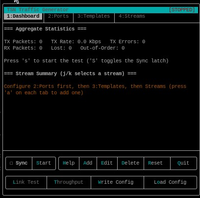
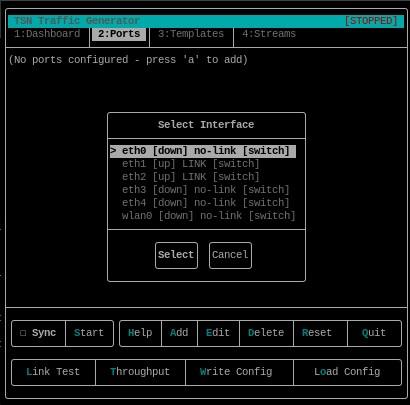
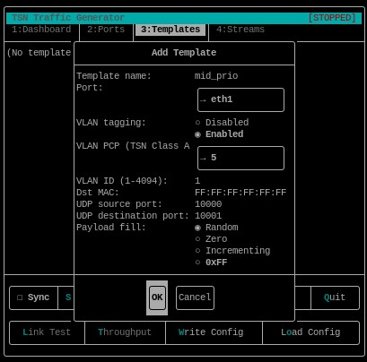
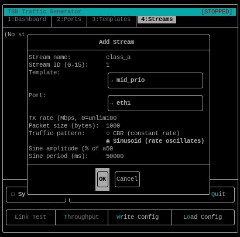
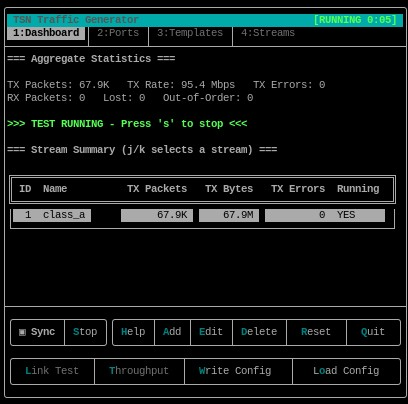

# Generating a Traffic Stream

This guide shows how to create and run a stream with the interactive TSN Traffic Generator interface.

## 1 Prerequisites

- Linux with a network interface that is up and connected
- Root privileges, which are required for raw packet transmission
- A built `tsn-traffic-gen` binary

From the repository root, build the application if needed:

```shell
cmake -S . -B build -DCMAKE_BUILD_TYPE=Release
cmake --build build -j"$(nproc)"
```

## 2 Use an existing configuration

If a configuration file already exists, load it when starting the application:

```shell
sudo tsn-traffic-gen -c config.ini
```

When using the binary built in this repository, run:

```shell
sudo ./build/tsn-traffic-gen -c config.ini
```

Replace `config.ini` with the path to your configuration file. Review the loaded ports, templates, and streams in the TUI, then press `s` or select **Start** to begin transmission.

## 3 Create and run a stream

1. Start the application from the repository root:

    ```bash
    sudo ./tsn-traffic-gen
    ```

    

2. Add a network port:
    - Press `2` to open **Ports**.
    - Press `a`, select the network interface that will transmit the traffic, and give the port a name.
    - For a DSA switch, select a user-facing port such as `lan0` or `swp0`, rather than the CPU or master interface.


    

3. Create a packet template:

    - Press `3` to open **Templates**, then press `a`.
    - Enter a template name and select the port created above.
    - Enable VLAN tagging if the stream needs a TSN priority. Set **VLAN PCP** to a value from `0` to `7`; PCP `5` is commonly used for TSN Class A.
    - Set the VLAN ID, destination MAC address, UDP ports, and payload fill as needed, then submit the form.

    

4. Create the stream:
    - Press `4` to open **Streams**, then press `a`.
    - Enter a stream name and a stream ID from `0` to `15`.
    - Select the packet template and transmit port.
    - Set the TX rate in Mbps (`0` means unlimited) and packet size in bytes.
    - Choose **CBR** for a constant rate, or **Sinusoid** for a rate that varies around the configured average. For Sinusoid, also set its amplitude and period.
    - Submit the form to add the stream.

    

5. Start transmission by pressing `s` or selecting **Start**. The generator starts every configured and enabled stream.

    

6. Press `1` to view the **Dashboard**. Use `j` and `k` to select a stream and inspect its TX/RX rate, packet counts, loss, ordering, and latency statistics.

7. Press `s` or select **Stop** when the test is complete. Press `w` if you want to save the configuration for later use, then press `q` to quit.

## 4 Synchronized start and stop

Use synchronized mode to start streams on multiple generator instances at the same target time.

1. Synchronize the system clocks on all participating hosts. For the VSC5641EV/LAN9662 TSN setup, use the procedure and pass criteria in [TSN Precision Time Protocol (802.1AS/gPTP)](tsn-ptp-(802.1as)-demo.md) when precise alignment is required.
2. Give every instance the same synchronization settings in the `[global]` section of its configuration:

    ```ini
    [global]
    test_id=1
    sync_port=45900
    sync_lead_ms=150
    ```

    `test_id` identifies the test, `sync_port` is the UDP broadcast port, and `sync_lead_ms` allows time for every instance to receive the command before the scheduled start.

3. Start each instance with its configuration file and leave the TUI running. Make sure UDP broadcast traffic on the configured port can pass between the hosts.
4. On the instance that will control the test, press uppercase `S` or select **Sync** to enable the Sync latch.
5. Press lowercase `s` or select **Start** on the controlling instance. It broadcasts the command through its first configured network port; instances with the matching `test_id` and `sync_port` schedule their streams for the same target time.
6. With the Sync latch still enabled, press `s` or select **Stop** on the controlling instance to schedule a synchronized stop across the instances.
## 5 Quick command-line example

For a single stream without using the TUI, run:

```bash
sudo ./tsn-traffic-gen --quick -i eth0 -m 100 -p 5 -s 1000 -d 30
```

This sends 100 Mbps of 1000-byte packets on `eth0`, tagged with VLAN PCP `5`, for 30 seconds. Replace `eth0` and the traffic settings with values appropriate for your test network.
